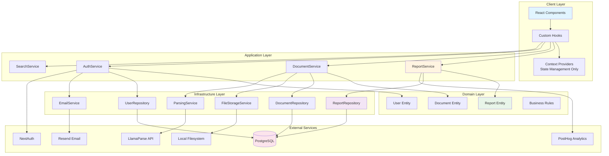
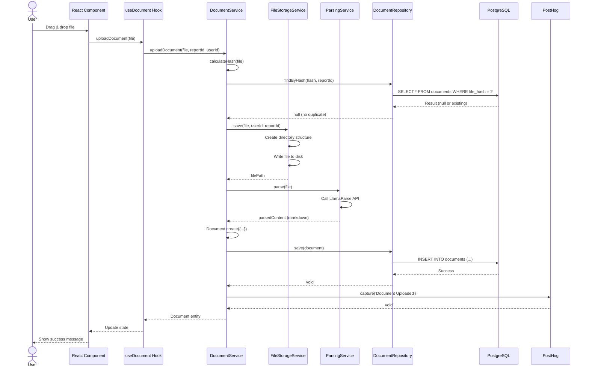
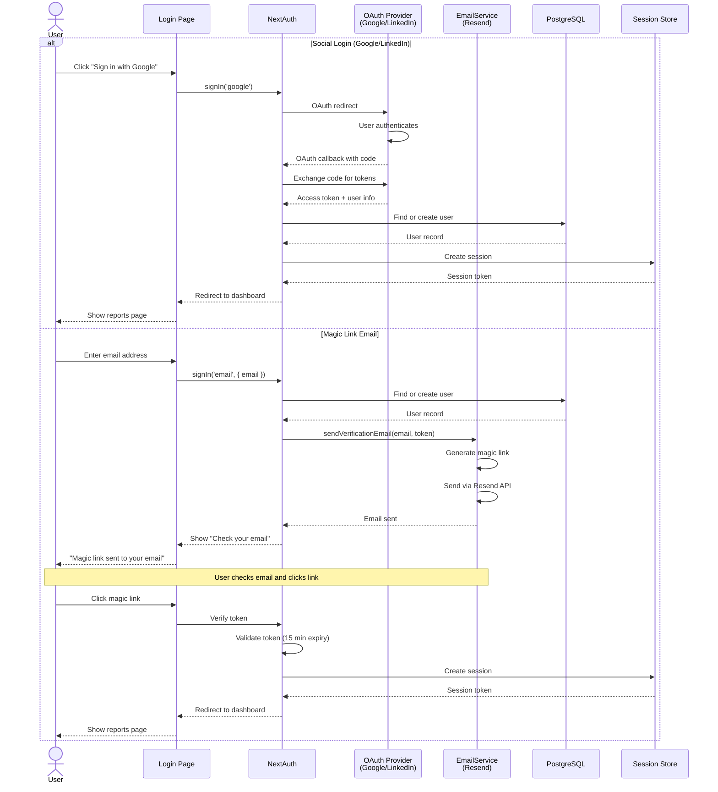
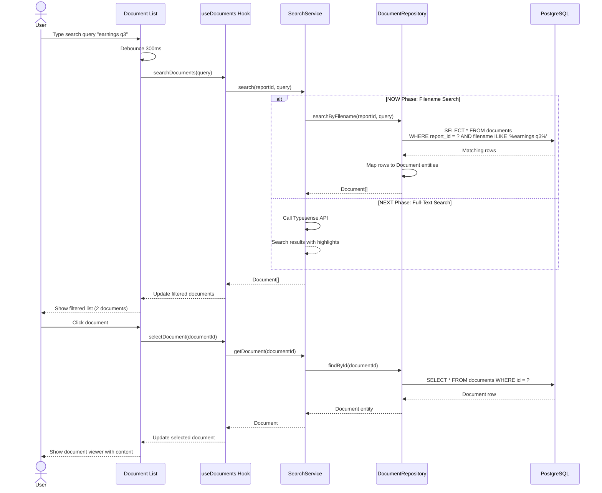
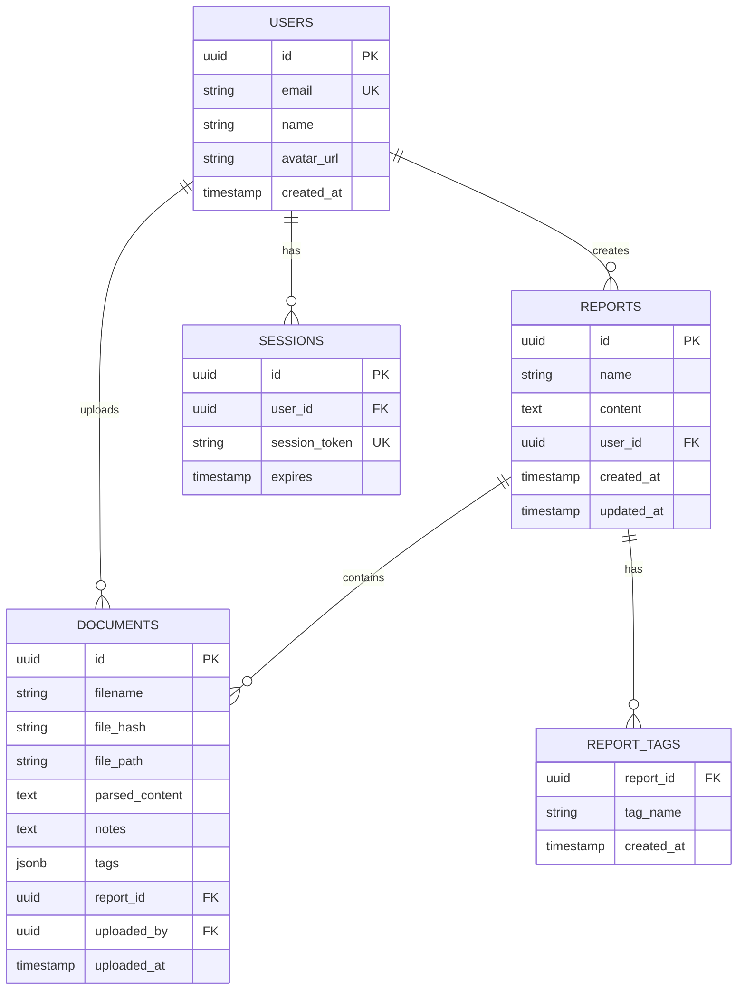

# ResearchHub: Architecture & System Design

**Document Version:** 1.0
**Date:** 2025-11-06
**Status:** Technical Specification
**Phase:** NOW (Core MVP)

---

## Table of Contents

1. [Executive Summary](#executive-summary)
2. [Architectural Principles](#architectural-principles)
3. [System Architecture Diagram](#system-architecture-diagram)
4. [Layered Architecture](#layered-architecture)
5. [Data Flow Diagrams](#data-flow-diagrams)
6. [Component Architecture](#component-architecture)
7. [Database Design](#database-design)
8. [API Design](#api-design)
9. [Security Architecture](#security-architecture)
10. [Performance Considerations](#performance-considerations)

---

## Executive Summary

ResearchHub is a research document management platform built for financial analysts. This document outlines the architecture for the **NOW phase** (Core MVP), which focuses on local development with a clean, maintainable codebase that addresses the architectural issues found in the legacy Curiocity application.

### Key Architectural Goals

1. **Clean Architecture**: Clear separation of concerns with dependency inversion
2. **Testability**: Every layer can be tested in isolation
3. **Maintainability**: Easy to understand, modify, and extend
4. **Scalability**: Architecture supports future cloud migration (NEXT phase)

### Tech Stack (NOW Phase)

- **Frontend**: Next.js 14 (App Router), React 18, TypeScript
- **Database**: PostgreSQL (Docker container)
- **Storage**: Local filesystem
- **Authentication**: NextAuth (Google, LinkedIn, Magic Link via Resend)
- **Document Parsing**: LlamaParse API
- **Editor**: React SimpleMDE
- **Analytics**: PostHog

---

## Architectural Principles

### 1. Separation of Concerns

**Problem in Legacy Code**: Business logic mixed in React Contexts (507-line God object), API routes containing types, utilities, and handlers.

**Our Solution**: Clear boundaries between layers:
- **Presentation**: React components (UI only)
- **Application**: Service classes (business logic)
- **Domain**: Entities and business rules
- **Infrastructure**: Database, file storage, external APIs

### 2. Dependency Inversion Principle

**Problem in Legacy Code**: Components directly call DynamoDB, no abstraction layer.

**Our Solution**: Outer layers depend on interfaces defined in inner layers.

```typescript
// BAD (Legacy):
Component → fetch('/api/db') → DynamoDB

// GOOD (ResearchHub):
Component → Service → IRepository ← DynamoRepository
                                  ← PostgresRepository (NOW)
```

### 3. Single Responsibility Principle

**Problem in Legacy Code**: `AppContext.tsx` contains state management + business logic + API calls.

**Our Solution**: One responsibility per class/module:
- **Context**: State management only
- **Service**: Business logic only
- **Repository**: Data access only
- **API Route**: HTTP handling only

### 4. DRY (Don't Repeat Yourself)

**Problem in Legacy Code**: 44 duplicate `marshall/unmarshall` calls, 10+ duplicate DynamoDB client instantiations.

**Our Solution**: Abstractions eliminate duplication:
- Repository pattern hides data access details
- Service layer encapsulates business logic
- API client abstracts HTTP calls

---

## System Architecture Diagram



### Architecture Flow

1. **UI Layer** (React Components): Renders UI, handles user interactions
2. **Custom Hooks**: Bridge between UI and services, manage component-level state
3. **Context Providers**: Global state only (current report, auth state)
4. **Service Layer**: Business logic (create report, upload document, search)
5. **Domain Layer**: Business entities and rules (Report, Document validation)
6. **Repository Layer**: Data access abstraction (CRUD operations)
7. **External Services**: Infrastructure (database, storage, APIs)

---

## Layered Architecture

### Layer 1: Presentation Layer

**Responsibility**: Render UI, handle user input, display data

**Components**:
- React components (`.tsx` files in `components/`)
- Custom hooks (`useReport`, `useDocument`, `useAuth`)
- Context providers for global state

**Rules**:
- ✅ Can call: Service layer (via hooks)
- ✅ Can access: Domain entities (for typing)
- ❌ Cannot: Directly access repositories or infrastructure
- ❌ Cannot: Contain business logic

**Example**:

```typescript
// components/ReportEditor.tsx
import { useReport } from '@/hooks/useReport';
import { Report } from '@/domain/entities/Report';

export function ReportEditor({ reportId }: Props) {
  const { report, updateContent, isLoading } = useReport(reportId);

  const handleSave = async (content: string) => {
    await updateContent(content); // Calls service layer
  };

  return (
    <div>
      <MarkdownEditor value={report?.content} onChange={handleSave} />
    </div>
  );
}
```

---

### Layer 2: Application Layer (Service Layer)

**Responsibility**: Business logic, use cases, orchestration

**Services**:
- `ReportService`: Create, update, delete reports
- `DocumentService`: Upload, parse, search documents
- `AuthService`: Login, logout, session management
- `SearchService`: Search reports and documents

**Rules**:
- ✅ Can call: Repository layer, domain entities
- ✅ Can access: External services (via dependency injection)
- ❌ Cannot: Import React components
- ❌ Cannot: Access database directly

**Example**:

```typescript
// services/DocumentService.ts
import { IDocumentRepository } from '@/repositories/IDocumentRepository';
import { IFileStorageService } from '@/services/IFileStorageService';
import { IParsingService } from '@/services/IParsingService';
import { Document } from '@/domain/entities/Document';
import { CreateDocumentDTO } from '@/domain/dto/DocumentDTO';

export class DocumentService {
  constructor(
    private documentRepo: IDocumentRepository,
    private fileStorage: IFileStorageService,
    private parsingService: IParsingService,
    private analytics: PostHog
  ) {}

  async uploadDocument(
    file: File,
    reportId: string,
    userId: string
  ): Promise<Document> {
    // Business logic: Check for duplicates
    const hash = await this.calculateHash(file);
    const existing = await this.documentRepo.findByHash(hash, reportId);

    if (existing) {
      throw new Error('Duplicate document already exists in this report');
    }

    // Store original file
    const filePath = await this.fileStorage.save(file, userId, reportId);

    // Parse document (async)
    const parsedContent = await this.parsingService.parse(file);

    // Create document entity
    const document = Document.create({
      filename: file.name,
      fileHash: hash,
      filePath,
      parsedContent,
      reportId,
      uploadedBy: userId,
    });

    // Save to database
    await this.documentRepo.save(document);

    // Track analytics
    this.analytics.capture({
      distinctId: userId,
      event: 'Document Uploaded',
      properties: {
        documentId: document.id,
        reportId,
        fileSize: file.size,
        fileType: file.type,
      },
    });

    return document;
  }

  async searchDocuments(reportId: string, query: string): Promise<Document[]> {
    // NOW phase: filename search only
    return this.documentRepo.searchByFilename(reportId, query);

    // NEXT phase: full-text search via Typesense
    // return this.searchService.search(reportId, query);
  }

  private async calculateHash(file: File): Promise<string> {
    const buffer = await file.arrayBuffer();
    const hash = crypto.createHash('sha256');
    hash.update(Buffer.from(buffer));
    return hash.digest('hex');
  }
}
```

---

### Layer 3: Domain Layer

**Responsibility**: Business entities, value objects, domain rules

**Components**:
- Entities: `Report`, `Document`, `User`, `Tag`
- Value Objects: `Email`, `FilePath`, `FileHash`
- Domain Services: Complex business rules
- DTOs: Data transfer objects for API contracts

**Rules**:
- ✅ Can: Define business rules and validation
- ❌ Cannot: Depend on outer layers (services, repositories)
- ❌ Cannot: Access infrastructure (database, file system)

**Example**:

```typescript
// domain/entities/Report.ts
import { Tag } from './Tag';

export class Report {
  private constructor(
    public readonly id: string,
    public name: string,
    public content: string,
    public tags: Tag[],
    public readonly userId: string,
    public readonly createdAt: Date,
    public updatedAt: Date
  ) {}

  static create(data: {
    name: string;
    userId: string;
    content?: string;
  }): Report {
    // Business rule: Report name required
    if (!data.name.trim()) {
      throw new Error('Report name cannot be empty');
    }

    // Business rule: Name length limit
    if (data.name.length > 200) {
      throw new Error('Report name cannot exceed 200 characters');
    }

    return new Report(
      crypto.randomUUID(),
      data.name.trim(),
      data.content || '',
      [],
      data.userId,
      new Date(),
      new Date()
    );
  }

  updateContent(content: string): void {
    this.content = content;
    this.updatedAt = new Date();
  }

  addTag(tag: Tag): void {
    // Business rule: No duplicate tags
    if (this.tags.some(t => t.name === tag.name)) {
      throw new Error('Tag already exists on this report');
    }

    // Business rule: Max 10 tags per report
    if (this.tags.length >= 10) {
      throw new Error('Cannot add more than 10 tags to a report');
    }

    this.tags.push(tag);
    this.updatedAt = new Date();
  }

  removeTag(tagName: string): void {
    this.tags = this.tags.filter(t => t.name !== tagName);
    this.updatedAt = new Date();
  }

  // Business rule: Can only delete if no documents attached
  canDelete(): boolean {
    // This would be checked by DocumentService
    return true;
  }
}
```

```typescript
// domain/entities/Document.ts
import { Tag } from './Tag';

export class Document {
  private constructor(
    public readonly id: string,
    public filename: string,
    public readonly fileHash: string,
    public readonly filePath: string,
    public parsedContent: string | null,
    public notes: string,
    public tags: Tag[],
    public readonly reportId: string,
    public readonly uploadedBy: string,
    public readonly uploadedAt: Date,
    public updatedAt: Date
  ) {}

  static create(data: {
    filename: string;
    fileHash: string;
    filePath: string;
    parsedContent: string | null;
    reportId: string;
    uploadedBy: string;
  }): Document {
    // Validation
    if (!data.filename.trim()) {
      throw new Error('Filename cannot be empty');
    }

    // Business rule: Only TXT and MD files in NOW phase
    const ext = data.filename.split('.').pop()?.toLowerCase();
    if (ext !== 'txt' && ext !== 'md') {
      throw new Error('Only TXT and MD files are supported in NOW phase');
    }

    return new Document(
      crypto.randomUUID(),
      data.filename.trim(),
      data.fileHash,
      data.filePath,
      data.parsedContent,
      '',
      [],
      data.reportId,
      data.uploadedBy,
      new Date(),
      new Date()
    );
  }

  updateNotes(notes: string): void {
    this.notes = notes;
    this.updatedAt = new Date();
  }

  addTag(tag: Tag): void {
    if (this.tags.some(t => t.name === tag.name)) {
      throw new Error('Tag already exists on this document');
    }

    this.tags.push(tag);
    this.updatedAt = new Date();
  }

  rename(newFilename: string): void {
    if (!newFilename.trim()) {
      throw new Error('Filename cannot be empty');
    }

    this.filename = newFilename.trim();
    this.updatedAt = new Date();
  }
}
```

---

### Layer 4: Infrastructure Layer

**Responsibility**: Data access, external service integration

**Components**:
- Repositories: `PostgresReportRepository`, `PostgresDocumentRepository`
- Infrastructure Services: `FileStorageService`, `ParsingService`, `EmailService`
- External API clients: `LlamaParseClient`, `ResendClient`

**Rules**:
- ✅ Can: Access database, file system, external APIs
- ✅ Implements: Interfaces defined in domain/service layer
- ❌ Cannot: Contain business logic

**Example**:

```typescript
// repositories/IDocumentRepository.ts (Interface in domain)
import { Document } from '@/domain/entities/Document';

export interface IDocumentRepository {
  save(document: Document): Promise<void>;
  findById(id: string): Promise<Document | null>;
  findByReportId(reportId: string): Promise<Document[]>;
  findByHash(hash: string, reportId: string): Promise<Document | null>;
  searchByFilename(reportId: string, query: string): Promise<Document[]>;
  delete(id: string): Promise<void>;
}
```

```typescript
// repositories/PostgresDocumentRepository.ts
import { Pool } from 'pg';
import { IDocumentRepository } from './IDocumentRepository';
import { Document } from '@/domain/entities/Document';

export class PostgresDocumentRepository implements IDocumentRepository {
  constructor(private db: Pool) {}

  async save(document: Document): Promise<void> {
    const query = `
      INSERT INTO documents (
        id, filename, file_hash, file_path, parsed_content, notes,
        tags, report_id, uploaded_by, uploaded_at, updated_at
      ) VALUES ($1, $2, $3, $4, $5, $6, $7, $8, $9, $10, $11)
      ON CONFLICT (id) DO UPDATE SET
        filename = EXCLUDED.filename,
        notes = EXCLUDED.notes,
        tags = EXCLUDED.tags,
        updated_at = EXCLUDED.updated_at
    `;

    const values = [
      document.id,
      document.filename,
      document.fileHash,
      document.filePath,
      document.parsedContent,
      document.notes,
      JSON.stringify(document.tags),
      document.reportId,
      document.uploadedBy,
      document.uploadedAt,
      document.updatedAt,
    ];

    await this.db.query(query, values);
  }

  async findById(id: string): Promise<Document | null> {
    const query = 'SELECT * FROM documents WHERE id = $1';
    const result = await this.db.query(query, [id]);

    if (result.rows.length === 0) return null;

    return this.mapRowToDocument(result.rows[0]);
  }

  async findByReportId(reportId: string): Promise<Document[]> {
    const query = `
      SELECT * FROM documents
      WHERE report_id = $1
      ORDER BY uploaded_at DESC
    `;
    const result = await this.db.query(query, [reportId]);

    return result.rows.map(row => this.mapRowToDocument(row));
  }

  async findByHash(hash: string, reportId: string): Promise<Document | null> {
    const query = `
      SELECT * FROM documents
      WHERE file_hash = $1 AND report_id = $2
    `;
    const result = await this.db.query(query, [hash, reportId]);

    if (result.rows.length === 0) return null;

    return this.mapRowToDocument(result.rows[0]);
  }

  async searchByFilename(reportId: string, query: string): Promise<Document[]> {
    const searchQuery = `
      SELECT * FROM documents
      WHERE report_id = $1 AND filename ILIKE $2
      ORDER BY uploaded_at DESC
    `;
    const result = await this.db.query(searchQuery, [
      reportId,
      `%${query}%`,
    ]);

    return result.rows.map(row => this.mapRowToDocument(row));
  }

  async delete(id: string): Promise<void> {
    const query = 'DELETE FROM documents WHERE id = $1';
    await this.db.query(query, [id]);
  }

  private mapRowToDocument(row: any): Document {
    // Map database row to domain entity
    // Note: Using a static factory method that bypasses validation for DB reads
    return new Document(
      row.id,
      row.filename,
      row.file_hash,
      row.file_path,
      row.parsed_content,
      row.notes || '',
      JSON.parse(row.tags || '[]'),
      row.report_id,
      row.uploaded_by,
      new Date(row.uploaded_at),
      new Date(row.updated_at)
    );
  }
}
```

```typescript
// services/FileStorageService.ts
import fs from 'fs/promises';
import path from 'path';
import { config } from '@/lib/config';

export interface IFileStorageService {
  save(file: File, userId: string, reportId: string): Promise<string>;
  read(filePath: string): Promise<Buffer>;
  delete(filePath: string): Promise<void>;
  exists(filePath: string): Promise<boolean>;
}

export class LocalFileStorageService implements IFileStorageService {
  private baseDir: string;

  constructor() {
    this.baseDir = config.storage.path;
  }

  async save(file: File, userId: string, reportId: string): Promise<string> {
    // Build path: storage/users/{userId}/reports/{reportId}/documents/{filename}
    const dir = path.join(
      this.baseDir,
      'users',
      userId,
      'reports',
      reportId,
      'documents'
    );

    // Ensure directory exists
    await fs.mkdir(dir, { recursive: true });

    // Save file with unique name (hash + extension)
    const ext = path.extname(file.name);
    const hash = crypto.randomUUID();
    const filename = `${hash}${ext}`;
    const filePath = path.join(dir, filename);

    const buffer = Buffer.from(await file.arrayBuffer());
    await fs.writeFile(filePath, buffer);

    // Return relative path for database storage
    return path.relative(this.baseDir, filePath);
  }

  async read(filePath: string): Promise<Buffer> {
    const fullPath = path.join(this.baseDir, filePath);
    return await fs.readFile(fullPath);
  }

  async delete(filePath: string): Promise<void> {
    const fullPath = path.join(this.baseDir, filePath);
    await fs.unlink(fullPath);
  }

  async exists(filePath: string): Promise<boolean> {
    const fullPath = path.join(this.baseDir, filePath);
    try {
      await fs.access(fullPath);
      return true;
    } catch {
      return false;
    }
  }
}
```

---

## Data Flow Diagrams

### 1. Upload Document Workflow



**Key Points**:
1. Hash calculated for duplicate detection
2. File stored first (fast), then parsed (slow)
3. Domain entity created with validation
4. Repository saves to database
5. Analytics tracked asynchronously
6. UI updated with new document

---

### 2. User Authentication Workflow



**Key Points**:
1. Two authentication flows: OAuth and Magic Link
2. NextAuth handles all OAuth complexity
3. Email service abstracted (Resend implementation)
4. User record created automatically on first login
5. Session stored securely (30-day expiry)

---

### 3. Search Documents Workflow



**Key Points**:
1. NOW phase: Simple filename search via PostgreSQL ILIKE
2. NEXT phase: Ready for full-text search via Typesense
3. Search debounced to avoid excessive queries
4. Results filtered on client for instant feedback
5. Document viewer loads full content on selection

---

## Component Architecture

### Component Tree Structure

```
app/
├── layout.tsx (Root layout with providers)
├── page.tsx (Landing page)
├── login/
│   └── page.tsx (Login page)
├── dashboard/
│   ├── layout.tsx (Authenticated layout)
│   ├── page.tsx (Report list)
│   └── [reportId]/
│       └── page.tsx (Report editor with documents)
│
components/
├── layouts/
│   ├── AuthenticatedLayout.tsx
│   └── PublicLayout.tsx
│
├── reports/
│   ├── ReportList.tsx (Grid of report cards)
│   ├── ReportCard.tsx (Single report preview)
│   ├── ReportEditor.tsx (Markdown editor)
│   ├── CreateReportModal.tsx
│   └── DeleteReportModal.tsx
│
├── documents/
│   ├── DocumentList.tsx (List of documents in report)
│   ├── DocumentCard.tsx (Single document item)
│   ├── DocumentViewer.tsx (Right panel viewer)
│   ├── DocumentUploader.tsx (Drag-drop + file picker)
│   ├── DocumentSearch.tsx (Search input)
│   └── DocumentMetadata.tsx (Notes, tags)
│
├── common/
│   ├── Button.tsx
│   ├── Input.tsx
│   ├── Modal.tsx
│   ├── Spinner.tsx
│   ├── Toast.tsx
│   └── Tag.tsx
│
└── auth/
    ├── LoginForm.tsx
    ├── SocialLoginButtons.tsx
    └── MagicLinkForm.tsx
```

---

### State Management Strategy

**Principle**: Context for global state, local state for component state.

#### Global State (React Context)

```typescript
// context/AuthContext.tsx
interface AuthState {
  user: User | null;
  isAuthenticated: boolean;
  isLoading: boolean;
}

export function AuthProvider({ children }: Props) {
  const { data: session, status } = useSession(); // NextAuth

  const value: AuthState = {
    user: session?.user || null,
    isAuthenticated: !!session,
    isLoading: status === 'loading',
  };

  return <AuthContext.Provider value={value}>{children}</AuthContext.Provider>;
}

// Usage:
const { user, isAuthenticated } = useAuth();
```

```typescript
// context/ReportContext.tsx (Current report only - NO business logic)
interface ReportState {
  currentReport: Report | null;
  setCurrentReport: (report: Report | null) => void;
}

export function ReportProvider({ children }: Props) {
  const [currentReport, setCurrentReport] = useState<Report | null>(null);

  return (
    <ReportContext.Provider value={{ currentReport, setCurrentReport }}>
      {children}
    </ReportContext.Provider>
  );
}
```

**Rules**:
- Context provides STATE only, not business logic
- No API calls inside context (use hooks + services)
- Keep context lean (single responsibility)

---

#### Custom Hooks (Bridge between UI and Services)

```typescript
// hooks/useReport.ts
import { useEffect, useState } from 'react';
import { Report } from '@/domain/entities/Report';
import { ReportService } from '@/services/ReportService';
import { useAuth } from '@/context/AuthContext';

export function useReport(reportId: string | null) {
  const [report, setReport] = useState<Report | null>(null);
  const [isLoading, setIsLoading] = useState(false);
  const [error, setError] = useState<string | null>(null);
  const { user } = useAuth();

  const reportService = new ReportService(); // Or use DI container

  useEffect(() => {
    if (!reportId) return;

    const loadReport = async () => {
      setIsLoading(true);
      setError(null);

      try {
        const data = await reportService.getReport(reportId);
        setReport(data);
      } catch (err) {
        setError(err.message);
      } finally {
        setIsLoading(false);
      }
    };

    loadReport();
  }, [reportId]);

  const updateContent = async (content: string) => {
    if (!report) return;

    try {
      await reportService.updateContent(report.id, content);
      setReport({ ...report, content });
    } catch (err) {
      setError(err.message);
      throw err;
    }
  };

  const addTag = async (tagName: string) => {
    if (!report) return;

    try {
      const updatedReport = await reportService.addTag(report.id, tagName);
      setReport(updatedReport);
    } catch (err) {
      setError(err.message);
      throw err;
    }
  };

  return {
    report,
    isLoading,
    error,
    updateContent,
    addTag,
  };
}
```

```typescript
// hooks/useDocuments.ts
import { useEffect, useState } from 'react';
import { Document } from '@/domain/entities/Document';
import { DocumentService } from '@/services/DocumentService';

export function useDocuments(reportId: string | null) {
  const [documents, setDocuments] = useState<Document[]>([]);
  const [filteredDocuments, setFilteredDocuments] = useState<Document[]>([]);
  const [isLoading, setIsLoading] = useState(false);
  const [searchQuery, setSearchQuery] = useState('');

  const documentService = new DocumentService();

  useEffect(() => {
    if (!reportId) return;

    const loadDocuments = async () => {
      setIsLoading(true);
      try {
        const docs = await documentService.getDocumentsByReport(reportId);
        setDocuments(docs);
        setFilteredDocuments(docs);
      } finally {
        setIsLoading(false);
      }
    };

    loadDocuments();
  }, [reportId]);

  // Client-side filtering for instant feedback
  useEffect(() => {
    if (!searchQuery.trim()) {
      setFilteredDocuments(documents);
      return;
    }

    const filtered = documents.filter(doc =>
      doc.filename.toLowerCase().includes(searchQuery.toLowerCase())
    );
    setFilteredDocuments(filtered);
  }, [searchQuery, documents]);

  const uploadDocument = async (file: File) => {
    const newDoc = await documentService.uploadDocument(file, reportId!);
    setDocuments(prev => [newDoc, ...prev]);
  };

  const deleteDocument = async (documentId: string) => {
    await documentService.deleteDocument(documentId);
    setDocuments(prev => prev.filter(d => d.id !== documentId));
  };

  return {
    documents: filteredDocuments,
    isLoading,
    searchQuery,
    setSearchQuery,
    uploadDocument,
    deleteDocument,
  };
}
```

---

### Code Organization Principles

#### 1. Feature-Based Organization

```
src/
├── domain/
│   ├── entities/
│   │   ├── Report.ts
│   │   ├── Document.ts
│   │   ├── User.ts
│   │   └── Tag.ts
│   ├── dto/
│   │   ├── ReportDTO.ts
│   │   └── DocumentDTO.ts
│   └── interfaces/
│       ├── IReportRepository.ts
│       └── IDocumentRepository.ts
│
├── services/
│   ├── ReportService.ts
│   ├── DocumentService.ts
│   ├── AuthService.ts
│   └── SearchService.ts
│
├── repositories/
│   ├── PostgresReportRepository.ts
│   ├── PostgresDocumentRepository.ts
│   └── PostgresUserRepository.ts
│
├── infrastructure/
│   ├── FileStorageService.ts
│   ├── ParsingService.ts (LlamaParse)
│   ├── EmailService.ts (Resend)
│   └── AnalyticsService.ts (PostHog)
│
├── lib/
│   ├── config.ts (Environment variables)
│   ├── database.ts (PostgreSQL connection pool)
│   ├── logger.ts (Structured logging)
│   └── errors.ts (Custom error classes)
│
├── hooks/
│   ├── useReport.ts
│   ├── useDocuments.ts
│   ├── useAuth.ts
│   └── useSearch.ts
│
├── context/
│   ├── AuthContext.tsx
│   └── ReportContext.tsx
│
└── components/
    └── [organized by feature as shown above]
```

#### 2. Naming Conventions

- **Entities**: PascalCase, singular (e.g., `Report`, `Document`)
- **Services**: PascalCase + "Service" suffix (e.g., `ReportService`)
- **Repositories**: PascalCase + "Repository" suffix (e.g., `PostgresDocumentRepository`)
- **Interfaces**: PascalCase + "I" prefix (e.g., `IDocumentRepository`)
- **Hooks**: camelCase + "use" prefix (e.g., `useReport`)
- **Components**: PascalCase (e.g., `ReportEditor`)
- **Files**: Match export name (e.g., `ReportService.ts` exports `ReportService`)

#### 3. Import Aliases

```typescript
// tsconfig.json
{
  "compilerOptions": {
    "baseUrl": ".",
    "paths": {
      "@/*": ["src/*"],
      "@/components/*": ["src/components/*"],
      "@/domain/*": ["src/domain/*"],
      "@/services/*": ["src/services/*"],
      "@/repositories/*": ["src/repositories/*"],
      "@/hooks/*": ["src/hooks/*"],
      "@/lib/*": ["src/lib/*"]
    }
  }
}

// Usage:
import { ReportService } from '@/services/ReportService';
import { Report } from '@/domain/entities/Report';
import { Button } from '@/components/common/Button';
```

---

## Database Design

### PostgreSQL Schema (NOW Phase)

```sql
-- Users table
CREATE TABLE users (
  id UUID PRIMARY KEY DEFAULT gen_random_uuid(),
  email VARCHAR(255) UNIQUE NOT NULL,
  name VARCHAR(255),
  avatar_url TEXT,
  created_at TIMESTAMP DEFAULT NOW(),
  updated_at TIMESTAMP DEFAULT NOW()
);

-- Reports table
CREATE TABLE reports (
  id UUID PRIMARY KEY DEFAULT gen_random_uuid(),
  name VARCHAR(200) NOT NULL,
  content TEXT DEFAULT '',
  user_id UUID NOT NULL REFERENCES users(id) ON DELETE CASCADE,
  created_at TIMESTAMP DEFAULT NOW(),
  updated_at TIMESTAMP DEFAULT NOW(),

  CONSTRAINT name_not_empty CHECK (LENGTH(TRIM(name)) > 0)
);

-- Report tags (many-to-many)
CREATE TABLE report_tags (
  report_id UUID NOT NULL REFERENCES reports(id) ON DELETE CASCADE,
  tag_name VARCHAR(50) NOT NULL,
  created_at TIMESTAMP DEFAULT NOW(),

  PRIMARY KEY (report_id, tag_name)
);

CREATE INDEX idx_report_tags_tag_name ON report_tags(tag_name);

-- Documents table
CREATE TABLE documents (
  id UUID PRIMARY KEY DEFAULT gen_random_uuid(),
  filename VARCHAR(255) NOT NULL,
  file_hash VARCHAR(64) NOT NULL, -- SHA-256 hash
  file_path TEXT NOT NULL,
  parsed_content TEXT, -- Markdown from LlamaParse
  notes TEXT DEFAULT '',
  tags JSONB DEFAULT '[]', -- Document-scoped tags
  report_id UUID NOT NULL REFERENCES reports(id) ON DELETE CASCADE,
  uploaded_by UUID NOT NULL REFERENCES users(id),
  uploaded_at TIMESTAMP DEFAULT NOW(),
  updated_at TIMESTAMP DEFAULT NOW(),

  CONSTRAINT filename_not_empty CHECK (LENGTH(TRIM(filename)) > 0),
  CONSTRAINT valid_file_extension CHECK (
    filename ~* '\.(txt|md)$' -- NOW phase: TXT/MD only
  )
);

-- Indexes for performance
CREATE INDEX idx_documents_report_id ON documents(report_id);
CREATE INDEX idx_documents_file_hash ON documents(file_hash);
CREATE INDEX idx_documents_filename ON documents(filename);
CREATE INDEX idx_documents_uploaded_at ON documents(uploaded_at DESC);

-- Prevent duplicate files within same report
CREATE UNIQUE INDEX idx_documents_unique_hash_per_report
  ON documents(report_id, file_hash);

-- Full-text search index (for NEXT phase)
CREATE INDEX idx_documents_filename_trgm ON documents
  USING gin (filename gin_trgm_ops);

-- Sessions table (for NextAuth)
CREATE TABLE sessions (
  id UUID PRIMARY KEY DEFAULT gen_random_uuid(),
  user_id UUID NOT NULL REFERENCES users(id) ON DELETE CASCADE,
  session_token VARCHAR(255) UNIQUE NOT NULL,
  expires TIMESTAMP NOT NULL,
  created_at TIMESTAMP DEFAULT NOW()
);

CREATE INDEX idx_sessions_user_id ON sessions(user_id);
CREATE INDEX idx_sessions_session_token ON sessions(session_token);

-- Magic link verification tokens
CREATE TABLE verification_tokens (
  identifier VARCHAR(255) NOT NULL, -- Email
  token VARCHAR(255) NOT NULL,
  expires TIMESTAMP NOT NULL,
  created_at TIMESTAMP DEFAULT NOW(),

  PRIMARY KEY (identifier, token)
);
```

### Data Relationships



---

## API Design

### API Route Structure

```
app/api/
├── auth/
│   └── [...nextauth]/
│       └── route.ts (NextAuth configuration)
│
├── reports/
│   ├── route.ts (GET all, POST create)
│   ├── [id]/
│   │   ├── route.ts (GET, PUT, DELETE)
│   │   └── tags/
│   │       └── route.ts (POST add, DELETE remove)
│
├── documents/
│   ├── route.ts (GET by reportId, POST upload)
│   ├── [id]/
│   │   ├── route.ts (GET, PUT, DELETE)
│   │   ├── content/
│   │   │   └── route.ts (GET original file)
│   │   └── tags/
│   │       └── route.ts (POST add, DELETE remove)
│   └── search/
│       └── route.ts (GET search by filename)
│
└── health/
    └── route.ts (Health check)
```

---

### API Endpoints Specification

#### Reports API

**GET /api/reports**
- Description: Get all reports for authenticated user
- Auth: Required
- Query Params: `?tags=tag1,tag2` (optional filter)
- Response: `Report[]`

**POST /api/reports**
- Description: Create new report
- Auth: Required
- Body: `{ name: string, tags?: string[] }`
- Response: `Report`

**GET /api/reports/[id]**
- Description: Get single report by ID
- Auth: Required (must own report)
- Response: `Report`

**PUT /api/reports/[id]**
- Description: Update report name/content
- Auth: Required (must own report)
- Body: `{ name?: string, content?: string }`
- Response: `Report`

**DELETE /api/reports/[id]**
- Description: Delete report (cascade deletes documents)
- Auth: Required (must own report)
- Response: `{ success: true }`

**POST /api/reports/[id]/tags**
- Description: Add tag to report
- Auth: Required
- Body: `{ tagName: string }`
- Response: `Report`

**DELETE /api/reports/[id]/tags**
- Description: Remove tag from report
- Auth: Required
- Body: `{ tagName: string }`
- Response: `Report`

---

#### Documents API

**GET /api/documents?reportId={id}**
- Description: Get all documents in a report
- Auth: Required (must own report)
- Response: `Document[]`

**POST /api/documents**
- Description: Upload document to report
- Auth: Required
- Body: `multipart/form-data` with fields:
  - `file`: File (TXT or MD)
  - `reportId`: string
- Response: `Document`

**GET /api/documents/[id]**
- Description: Get document metadata and parsed content
- Auth: Required
- Response: `Document`

**PUT /api/documents/[id]**
- Description: Update document metadata (notes, tags)
- Auth: Required
- Body: `{ notes?: string, filename?: string }`
- Response: `Document`

**DELETE /api/documents/[id]**
- Description: Delete document and file
- Auth: Required
- Response: `{ success: true }`

**GET /api/documents/[id]/content**
- Description: Download original file
- Auth: Required
- Response: Binary file with appropriate Content-Type

**GET /api/documents/search?reportId={id}&q={query}**
- Description: Search documents by filename (NOW phase)
- Auth: Required
- Response: `Document[]`

---

### API Implementation Example

```typescript
// app/api/reports/route.ts
import { NextRequest, NextResponse } from 'next/server';
import { getServerSession } from 'next-auth';
import { ReportService } from '@/services/ReportService';
import { authOptions } from '../auth/[...nextauth]/route';

export async function GET(request: NextRequest) {
  // Authentication
  const session = await getServerSession(authOptions);
  if (!session) {
    return NextResponse.json({ error: 'Unauthorized' }, { status: 401 });
  }

  try {
    // Extract query params
    const { searchParams } = new URL(request.url);
    const tags = searchParams.get('tags')?.split(',') || [];

    // Call service layer
    const reportService = new ReportService(); // Or inject from container
    const reports = await reportService.getReportsByUser(
      session.user.id,
      tags
    );

    return NextResponse.json(reports);
  } catch (error) {
    console.error('Error fetching reports:', error);
    return NextResponse.json(
      { error: 'Internal server error' },
      { status: 500 }
    );
  }
}

export async function POST(request: NextRequest) {
  const session = await getServerSession(authOptions);
  if (!session) {
    return NextResponse.json({ error: 'Unauthorized' }, { status: 401 });
  }

  try {
    const body = await request.json();
    const { name, tags } = body;

    // Validation
    if (!name || typeof name !== 'string') {
      return NextResponse.json(
        { error: 'Report name is required' },
        { status: 400 }
      );
    }

    // Call service layer
    const reportService = new ReportService();
    const report = await reportService.createReport({
      name,
      userId: session.user.id,
      tags,
    });

    return NextResponse.json(report, { status: 201 });
  } catch (error) {
    if (error.message.includes('cannot be empty')) {
      return NextResponse.json({ error: error.message }, { status: 400 });
    }

    console.error('Error creating report:', error);
    return NextResponse.json(
      { error: 'Internal server error' },
      { status: 500 }
    );
  }
}
```

---

## Security Architecture

### 1. Authentication & Authorization

**NextAuth Configuration**:
- JWT-based sessions (httpOnly cookies)
- Session expiry: 30 days
- Refresh tokens for long-lived sessions
- Secure token storage (not accessible via JavaScript)

**OAuth Providers**:
- Google: Verified email automatically
- LinkedIn: Requires email scope

**Magic Link**:
- Token valid for 15 minutes
- One-time use (deleted after verification)
- Rate limited (3 emails per hour per address)

---

### 2. Authorization Patterns

```typescript
// lib/auth/authorization.ts
export async function requireAuth(request: NextRequest) {
  const session = await getServerSession(authOptions);

  if (!session) {
    throw new UnauthorizedError('Authentication required');
  }

  return session;
}

export async function requireReportOwnership(
  reportId: string,
  userId: string
): Promise<void> {
  const reportService = new ReportService();
  const report = await reportService.getReport(reportId);

  if (report.userId !== userId) {
    throw new ForbiddenError('You do not own this report');
  }
}

// Usage in API route:
export async function DELETE(
  request: NextRequest,
  { params }: { params: { id: string } }
) {
  const session = await requireAuth(request);
  await requireReportOwnership(params.id, session.user.id);

  // Proceed with deletion...
}
```

---

### 3. Input Validation

**Validation Layer**: Domain entities enforce business rules

```typescript
// domain/entities/Report.ts
export class Report {
  static create(data: CreateReportData): Report {
    // Validation happens in entity
    if (!data.name.trim()) {
      throw new ValidationError('Report name cannot be empty');
    }

    if (data.name.length > 200) {
      throw new ValidationError('Report name too long (max 200 characters)');
    }

    // Create entity
  }
}
```

**API Layer**: Additional validation before service call

```typescript
// app/api/reports/route.ts
export async function POST(request: NextRequest) {
  const body = await request.json();

  // Type validation
  if (typeof body.name !== 'string') {
    return NextResponse.json(
      { error: 'Invalid name type' },
      { status: 400 }
    );
  }

  // Business validation happens in domain layer
  try {
    const report = await reportService.createReport(body);
    return NextResponse.json(report);
  } catch (error) {
    if (error instanceof ValidationError) {
      return NextResponse.json({ error: error.message }, { status: 400 });
    }
    throw error;
  }
}
```

---

### 4. File Upload Security

**File Type Validation**:
```typescript
// services/DocumentService.ts
const ALLOWED_EXTENSIONS = ['.txt', '.md']; // NOW phase
const MAX_FILE_SIZE = 25 * 1024 * 1024; // 25MB (LlamaParse limit)

export class DocumentService {
  async uploadDocument(file: File, reportId: string): Promise<Document> {
    // Validate extension
    const ext = path.extname(file.name).toLowerCase();
    if (!ALLOWED_EXTENSIONS.includes(ext)) {
      throw new ValidationError(
        `File type ${ext} not allowed. Only TXT and MD files are supported.`
      );
    }

    // Validate size
    if (file.size > MAX_FILE_SIZE) {
      throw new ValidationError('File size exceeds 25MB limit');
    }

    // Validate MIME type (additional check)
    if (!file.type.startsWith('text/')) {
      throw new ValidationError('Invalid file type');
    }

    // Proceed with upload...
  }
}
```

**File Storage Security**:
```typescript
// infrastructure/FileStorageService.ts
export class LocalFileStorageService implements IFileStorageService {
  async save(file: File, userId: string, reportId: string): Promise<string> {
    // Sanitize filename (remove path traversal attempts)
    const safeName = path.basename(file.name).replace(/[^a-zA-Z0-9.-]/g, '_');

    // Use UUIDs for file names (prevent collisions and guessing)
    const fileId = crypto.randomUUID();
    const ext = path.extname(safeName);
    const filename = `${fileId}${ext}`;

    // Build path: storage/users/{userId}/reports/{reportId}/documents/{filename}
    // User cannot escape their own directory
    const dir = path.join(
      this.baseDir,
      'users',
      userId,
      'reports',
      reportId,
      'documents'
    );

    // Ensure directory exists with proper permissions
    await fs.mkdir(dir, { recursive: true, mode: 0o755 });

    const filePath = path.join(dir, filename);

    // Write file with restricted permissions
    await fs.writeFile(filePath, buffer, { mode: 0o644 });

    return path.relative(this.baseDir, filePath);
  }
}
```

---

### 5. SQL Injection Prevention

**Parameterized Queries**: Always use prepared statements

```typescript
// repositories/PostgresDocumentRepository.ts
export class PostgresDocumentRepository implements IDocumentRepository {
  async searchByFilename(reportId: string, query: string): Promise<Document[]> {
    // SAFE: Uses parameterized query
    const sql = `
      SELECT * FROM documents
      WHERE report_id = $1 AND filename ILIKE $2
      ORDER BY uploaded_at DESC
    `;

    const result = await this.db.query(sql, [reportId, `%${query}%`]);

    return result.rows.map(row => this.mapRowToDocument(row));
  }

  // NEVER do this:
  // const sql = `SELECT * FROM documents WHERE filename LIKE '%${query}%'`; ❌
}
```

---

### 6. Environment Variable Security

```typescript
// lib/config.ts
import { z } from 'zod';

const configSchema = z.object({
  database: z.object({
    url: z.string().url(),
  }),
  auth: z.object({
    nextAuthSecret: z.string().min(32),
    googleClientId: z.string(),
    googleClientSecret: z.string(),
  }),
  storage: z.object({
    path: z.string(),
  }),
  llamaParse: z.object({
    apiKey: z.string(),
  }),
});

function loadConfig() {
  const rawConfig = {
    database: {
      url: process.env.DATABASE_URL,
    },
    auth: {
      nextAuthSecret: process.env.NEXTAUTH_SECRET,
      googleClientId: process.env.GOOGLE_CLIENT_ID,
      googleClientSecret: process.env.GOOGLE_CLIENT_SECRET,
    },
    storage: {
      path: process.env.STORAGE_PATH || './storage',
    },
    llamaParse: {
      apiKey: process.env.LLAMA_CLOUD_API_KEY,
    },
  };

  // Validate config at startup (fail fast)
  try {
    return configSchema.parse(rawConfig);
  } catch (error) {
    console.error('Configuration validation failed:', error);
    throw new Error('Invalid configuration. Check your environment variables.');
  }
}

export const config = loadConfig();
```

---

## Performance Considerations

### 1. Database Optimization

**Indexes** (defined in schema):
- `idx_documents_report_id`: Fast lookup by report
- `idx_documents_file_hash`: Fast duplicate detection
- `idx_documents_filename`: Fast filename search
- `idx_documents_uploaded_at`: Fast sorting by date

**Query Optimization**:
```typescript
// Good: Selective query with index
const result = await db.query(
  'SELECT * FROM documents WHERE report_id = $1 ORDER BY uploaded_at DESC',
  [reportId]
); // Uses idx_documents_report_id + idx_documents_uploaded_at

// Bad: Full table scan
const result = await db.query('SELECT * FROM documents');
```

---

### 2. File Storage Performance

**NOW Phase**: Local filesystem
- Fast read/write (no network latency)
- Limited by disk I/O

**NEXT Phase**: Supabase Storage (migration ready)
```typescript
// Interface allows easy swap
export interface IFileStorageService {
  save(file: File, userId: string, reportId: string): Promise<string>;
  read(filePath: string): Promise<Buffer>;
  delete(filePath: string): Promise<void>;
}

// NOW: LocalFileStorageService
// NEXT: SupabaseStorageService (same interface)
```

---

### 3. Parsing Performance

**Async Parsing**: Don't block upload on parsing
```typescript
// services/DocumentService.ts
export class DocumentService {
  async uploadDocument(file: File, reportId: string): Promise<Document> {
    // Save file first (fast)
    const filePath = await this.fileStorage.save(file, userId, reportId);

    // Create document with null parsedContent
    const document = Document.create({
      filename: file.name,
      filePath,
      parsedContent: null, // Parse later
      reportId,
    });

    await this.documentRepo.save(document);

    // Parse asynchronously (slow, doesn't block response)
    this.parseDocumentAsync(document.id, file);

    return document;
  }

  private async parseDocumentAsync(documentId: string, file: File): Promise<void> {
    try {
      const parsedContent = await this.parsingService.parse(file);
      await this.documentRepo.updateParsedContent(documentId, parsedContent);
    } catch (error) {
      console.error('Parsing failed:', error);
      // Document still accessible, just without parsed content
    }
  }
}
```

---

### 4. Frontend Performance

**Code Splitting**: Lazy load components
```typescript
// app/dashboard/[reportId]/page.tsx
import dynamic from 'next/dynamic';

const DocumentViewer = dynamic(() => import('@/components/documents/DocumentViewer'), {
  loading: () => <Spinner />,
  ssr: false,
});
```

**Debounced Search**:
```typescript
// hooks/useDocuments.ts
import { useDebouncedValue } from '@/hooks/useDebouncedValue';

export function useDocuments(reportId: string) {
  const [searchQuery, setSearchQuery] = useState('');
  const debouncedQuery = useDebouncedValue(searchQuery, 300); // 300ms delay

  useEffect(() => {
    // Only search after user stops typing
    if (debouncedQuery) {
      searchDocuments(debouncedQuery);
    }
  }, [debouncedQuery]);
}
```

**Virtualized Lists**: For 100+ documents
```typescript
// components/documents/DocumentList.tsx
import { FixedSizeList } from 'react-window';

export function DocumentList({ documents }: Props) {
  return (
    <FixedSizeList
      height={600}
      itemCount={documents.length}
      itemSize={80}
      width="100%"
    >
      {({ index, style }) => (
        <DocumentCard document={documents[index]} style={style} />
      )}
    </FixedSizeList>
  );
}
```

---

## Summary

### What We Fixed from Legacy Code

| Legacy Issue | ResearchHub Solution |
|--------------|----------------------|
| God object (507-line Context) | Separate Context (state only) + Service layer (business logic) |
| Business logic in UI | Service classes with single responsibility |
| No repository pattern | `IRepository` interface with PostgreSQL implementation |
| 44 duplicate DB calls | Repository encapsulates all data access |
| 31 direct fetch calls | API client abstraction + Custom hooks |
| No dependency injection | DI container + Constructor injection |
| Type duplication | Single source of truth in `domain/entities/` |
| Hard to test | Every layer testable in isolation |

---

### Architecture Benefits

1. **Testability**: Mock any layer (repositories, services, external APIs)
2. **Maintainability**: Clear boundaries, single responsibility
3. **Scalability**: Easy to swap implementations (PostgreSQL → Supabase in NEXT)
4. **Developer Experience**: Easy to onboard, understand, and extend

---

### Migration Path (NEXT Phase)

The architecture supports cloud migration without major refactoring:

| Component | NOW | NEXT |
|-----------|-----|------|
| Database | PostgreSQL (Docker) | Supabase PostgreSQL |
| File Storage | LocalFileStorageService | SupabaseStorageService |
| Repository | PostgresDocumentRepository | SupabaseDocumentRepository (or keep PostgreSQL) |
| Search | SQL ILIKE | Typesense full-text search |

All changes isolated to infrastructure layer—services and UI remain unchanged.

---

**Document End**
