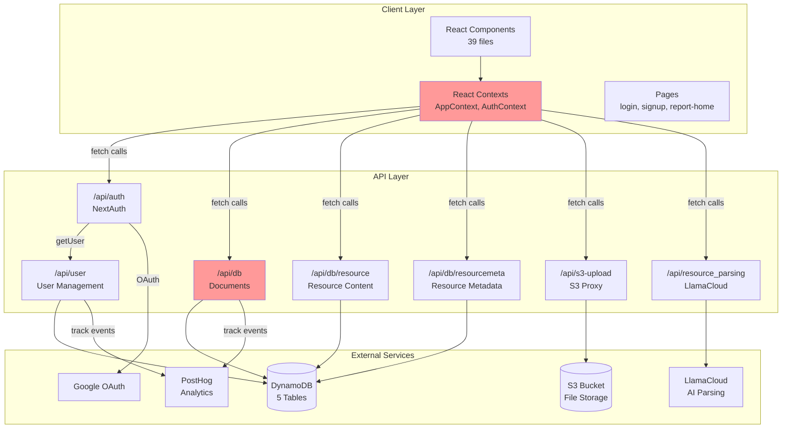
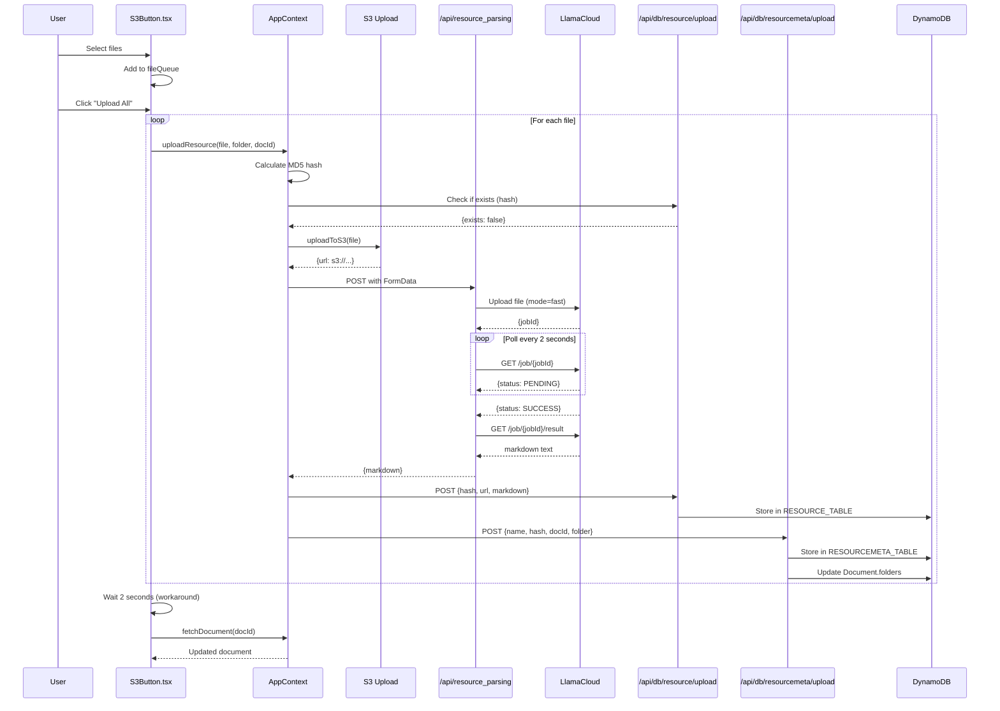
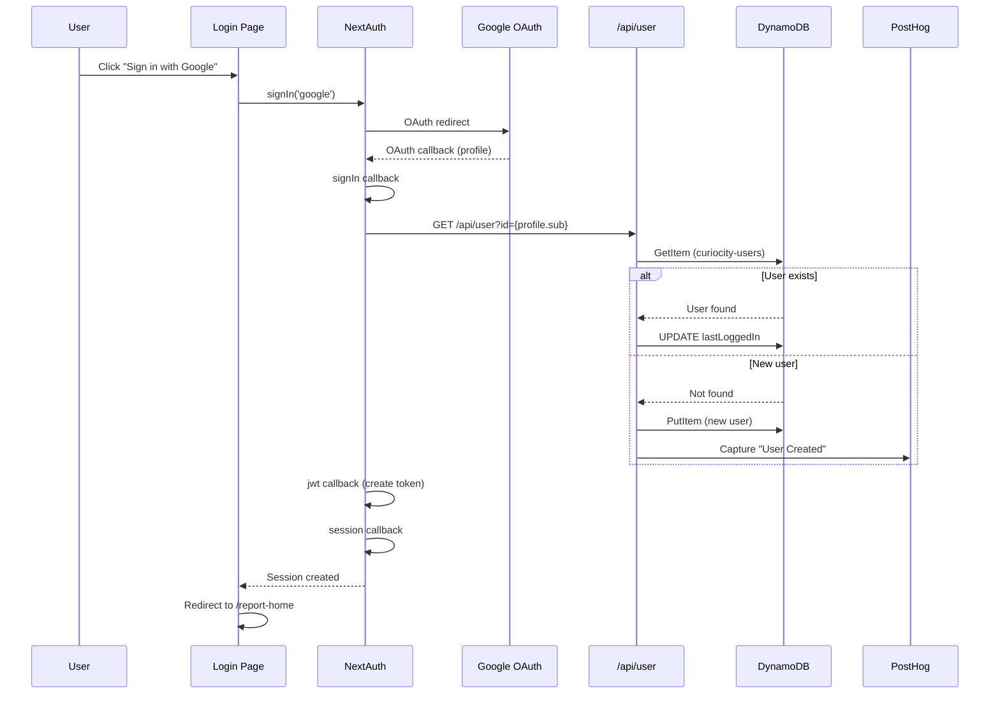
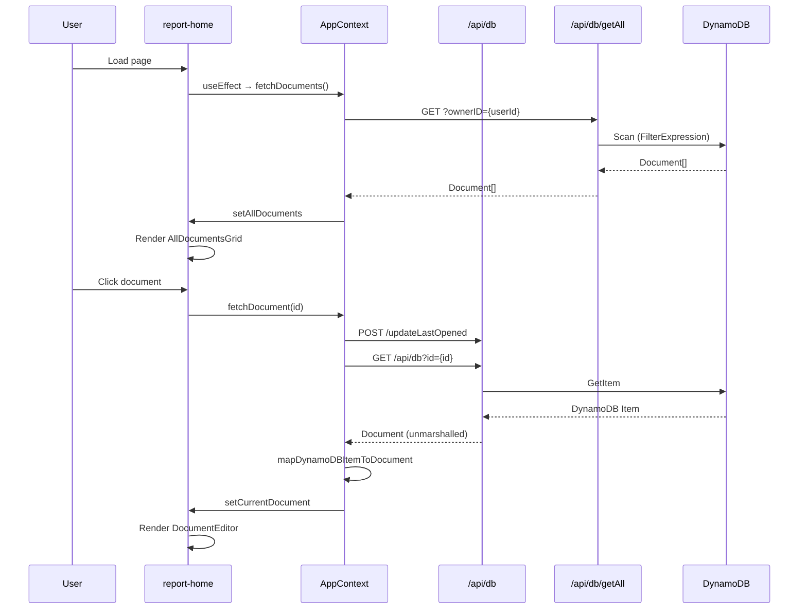
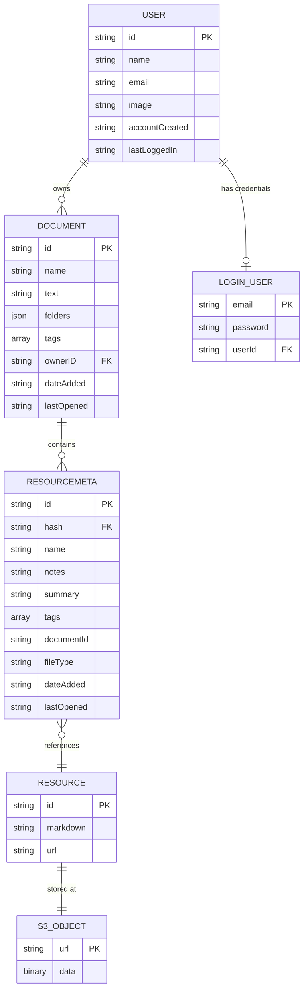
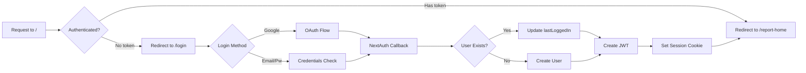
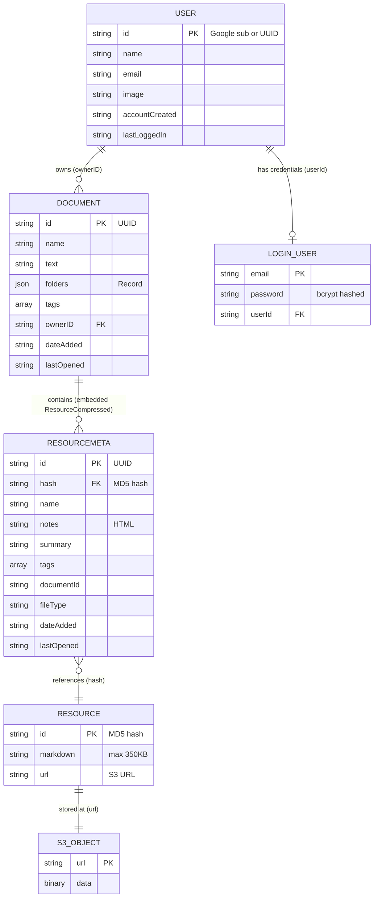

# Curiocity (Apex) - Complete Codebase Knowledge Document

**Generated**: 2025-11-05
**Purpose**: Comprehensive reference for implementing features, fixing bugs, and safe refactoring
**Repository**: Curiocity - Document and Resource Management Platform

---

## Table of Contents

1. [High-Level Overview](#high-level-overview)
2. [System Architecture](#system-architecture)
3. [Feature Catalog](#feature-catalog)
4. [Critical Nuances & Gotchas](#critical-nuances--gotchas)
5. [Technical Reference](#technical-reference)
6. [Domain Glossary](#domain-glossary)
7. [Database Schema](#database-schema)
8. [API Reference](#api-reference)
9. [Development Guide](#development-guide)

---

# 1. High-Level Overview

## What is Curiocity?

**Curiocity** is a document and resource management platform that allows users to:

- Upload files (PDFs, documents, images) and organize them into documents with folder structures
- Automatically parse file content into markdown using AI (LlamaCloud)
- Store files efficiently in S3 with content deduplication
- Manage metadata (notes, tags, summaries) for each uploaded resource
- View and edit document content with a rich text editor
- Search, filter, and organize resources

## Business Purpose

**Primary Goal**: Enable individuals and teams to manage collections of documents and files with rich metadata, intelligent parsing, and flexible organization.

**Target Users**: Knowledge workers, researchers, teams managing documentation, anyone needing to organize and search through file collections.

## Tech Stack

### Frontend

- **Framework**: Next.js 14.2.13 (App Router with Turbo)
- **Language**: TypeScript 5.7.2 (strict mode, but errors ignored in builds)
- **Styling**: Tailwind CSS 3.4.1
- **UI Components**: shadcn/ui, Radix UI, Chakra UI
- **State Management**: React Context API
- **Rich Text**: ReactQuill 2.0.0
- **Drag & Drop**: @dnd-kit/core 6.1.0

### Backend

- **Runtime**: Node.js 18.x
- **Database**: AWS DynamoDB (5 tables)
- **File Storage**: AWS S3 (wdb-curiocity-bucket, us-west-1)
- **Authentication**: NextAuth 4.24.10 (Google OAuth + Email/Password)
- **File Parsing**: LlamaCloud API (LlamaIndex)
- **Analytics**: PostHog (client + server SDKs)

### Development Tools

- **Testing**: Jest 29.7.0 + React Testing Library
- **Linting**: ESLint + Prettier
- **Pre-commit**: Husky + lint-staged
- **Deployment**: Vercel (manual deployment)

## Main Features

1. **Document Management** - Create, organize, and manage documents with folder structures
2. **Resource Upload** - Upload files to S3 with automatic AI parsing
3. **Content Deduplication** - Store identical files once, metadata separately
4. **Metadata Management** - Notes, tags, summaries for each resource
5. **Search & Filtering** - Filter by file type, date range, search by name
6. **Authentication** - Google OAuth or email/password
7. **Rich Text Editing** - Quill-based editor for documents and notes
8. **Analytics** - PostHog event tracking for all major actions

## Repository Structure

```
apex/
├── app/                          # Next.js App Router
│   ├── api/                      # API routes (28 endpoints)
│   │   ├── auth/                 # NextAuth configuration
│   │   │   └── [...nextauth]/route.ts
│   │   ├── db/                   # Database operations
│   │   │   ├── route.ts          # Document CRUD + shared helpers
│   │   │   ├── documents/        # Folder operations
│   │   │   ├── resource/         # Resource content
│   │   │   ├── resourcemeta/     # Resource metadata
│   │   │   ├── getAll/           # Fetch all documents
│   │   │   ├── updateLastOpened/ # Timestamp updates
│   │   │   ├── newTag/           # Add tags
│   │   │   └── deleteTag/        # Remove tags
│   │   ├── resource_parsing/     # LlamaCloud parsing
│   │   ├── s3-upload/            # S3 file upload
│   │   ├── user/                 # User management
│   │   ├── manual-signup/        # Email/password registration
│   │   └── reset-password/       # Password reset (incomplete)
│   ├── login/                    # Login page
│   ├── signup/                   # Signup page
│   ├── report-home/              # Main application (post-login)
│   └── layout.tsx                # Root layout with providers
│
├── components/                   # React components (39 files)
│   ├── DocumentComponents/       # Document UI
│   │   ├── AllDocumentsGrid.tsx  # Document listing
│   │   ├── DocumentEditor.tsx    # Document editor
│   │   ├── TextEditor.tsx        # Quill editor wrapper
│   │   └── TagSection.tsx        # Tag management
│   ├── ResourceComponents/       # Resource UI
│   │   ├── S3Button.tsx          # File upload
│   │   ├── FileList.tsx          # Resource listing + filtering
│   │   ├── ResourceViewer.tsx    # Resource display
│   │   └── NotesEditor.tsx       # Notes editing
│   ├── GeneralComponents/        # Shared UI
│   ├── ModalComponents/          # Modal dialogs
│   ├── PostHogComponents/        # Analytics
│   └── ui/                       # shadcn/ui components
│
├── context/                      # React Context state
│   ├── AppContext.tsx            # Resources + Documents (507 lines)
│   ├── AuthContext.tsx           # NextAuth wrapper
│   └── SwitchContext.tsx         # UI toggle state
│
├── types/
│   └── types.tsx                 # Type definitions
│
├── lib/
│   └── utils.ts                  # Tailwind utility
│
├── middleware.ts                 # Auth redirects
├── next.config.js                # Next.js config
├── tsconfig.json                 # TypeScript config
└── package.json                  # Dependencies
```

---

# 2. System Architecture

## Architecture Pattern

**Type**: Poorly Implemented Layered Architecture

**Layers**:

- ✅ **Presentation**: React components
- ⚠️ **Application**: React Context (anti-pattern - should be service layer)
- ❌ **Service Layer**: **Missing** - business logic scattered
- ❌ **Data Access**: **Missing** - no repository pattern
- ✅ **External Services**: DynamoDB, S3, LlamaCloud, PostHog

## Component Interaction Map



## Data Flow Examples

### Flow 1: Resource Upload (Complete)



### Flow 2: User Authentication (Google OAuth)



### Flow 3: Document Viewing



## Database Architecture

### Tables & Relationships



### Deduplication Model

**Key Insight**: Resource content is deduplicated, metadata is NOT.

```
File Upload (photo.jpg) → MD5 Hash (abc123)
                           ↓
                    Check RESOURCE_TABLE
                           ↓
        ┌──────────────────┴──────────────────┐
        ↓ Exists                               ↓ New
    Skip parsing                           Upload to S3
    Skip S3 upload                         Parse with LlamaCloud
                                          Store in RESOURCE_TABLE
        └──────────────────┬──────────────────┘
                           ↓
                  Always create ResourceMeta
                  (unique ID, user's name/notes)
                           ↓
                  Add to Document.folders[X]
```

## Cross-Cutting Concerns

### Authentication Flow



**Implementation**:

- **Middleware**: `middleware.ts:8-22` - Protects root path only
- **NextAuth Config**: `app/api/auth/[...nextauth]/route.ts:33`
- **Providers**: GoogleProvider + CredentialsProvider
- **Session**: JWT-based (not database sessions)
- **Context**: AuthProvider wraps app in `app/layout.tsx:27`

### State Management

**Provider Nesting** (app/layout.tsx):

```jsx
<AuthProvider>
  {' '}
  // NextAuth session
  <SwitchContextProvider>
    {' '}
    // UI toggle state
    <CurrentDocumentProvider>
      {' '}
      // Document CRUD + state
      <CurrentResourceProvider>
        {' '}
        // Resource CRUD + state
        {children}
      </CurrentResourceProvider>
    </CurrentDocumentProvider>
  </SwitchContextProvider>
</AuthProvider>
```

**Issue**: All state lives in root providers (no lazy loading, tight coupling)

### Error Handling

**Pattern Observed**:

```typescript
// API Routes
try {
  const result = await operation();
  return Response.json(result);
} catch (error) {
  console.error('Error:', error);
  return new Response(JSON.stringify({ error: 'Message' }), { status: 500 });
}
```

**Missing**:

- No retry logic
- No user-facing error notifications
- No global error boundary
- No structured error logging
- Network failures not handled gracefully

### Analytics (PostHog)

**Events Tracked**:

- Document: Created, Updated, Deleted, Last Opened
- User: Created, Updated, Deleted
- All events include: distinctId, timestamp, event name, properties

**Implementation**:

```typescript
// Server-side (app/api/db/route.ts:21)
const posthog = new PostHog(process.env.NEXT_PUBLIC_POSTHOG_KEY, {
  host: process.env.NEXT_PUBLIC_POSTHOG_HOST,
});

posthog.capture({
  distinctId: userId,
  event: 'Document Created',
  properties: { documentId, name, createdAt },
});

await posthog.flush();
```

---

# 3. Feature Catalog

## Feature 1: Document Management

**Purpose**: Organize resources into documents with folder structures

**Entry Points**:

- UI: `components/DocumentComponents/AllDocumentsGrid.tsx`
- API: `app/api/db/route.ts` (POST, GET, PUT, DELETE)

**Key Functions**:

- `createDocument()` - context/AppContext.tsx:403
- `fetchDocuments()` - context/AppContext.tsx:343
- `fetchDocument()` - context/AppContext.tsx:369

**Database**:

- Table: `DOCUMENT_TABLE`
- Schema: {id, name, text, folders, tags, ownerID, dateAdded, lastOpened}

**Interactions**:

- Creates default "General" folder on creation
- Cascade deletes all ResourceMeta in folders when document deleted
- PostHog events: Created, Updated, Deleted

**Gotchas**:

- Document IDs are UUIDs generated server-side
- Deleting document doesn't delete Resource entries (only ResourceMeta)
- PUT doesn't allow overwriting resources field (line 176 in db/route.ts)

---

## Feature 2: Resource Upload

**Purpose**: Upload files with automatic parsing and S3 storage

**Entry Points**:

- UI: `components/ResourceComponents/S3Button.tsx`
- API: `app/api/db/resource/upload/route.ts`, `app/api/db/resourcemeta/upload/route.ts`

**Key Functions**:

- `uploadResource()` - context/AppContext.tsx:152
- `extractText()` - context/AppContext.tsx:114
- `handleUploadAll()` - components/ResourceComponents/S3Button.tsx:38

**Database**:

- Tables: `RESOURCE_TABLE` (content), `RESOURCEMETA_TABLE` (metadata)
- Deduplication: Hash-based for Resource, always new ResourceMeta

**Flow**:

1. Calculate MD5 hash of file
2. Check if Resource exists (GET /api/db/resource/check)
3. Upload to S3 (next-s3-upload)
4. Parse with LlamaCloud (if new and not image)
5. Store Resource (if new)
6. Create ResourceMeta (always)
7. Update Document.folders

**Gotchas**:

- 2-second delay after uploads (S3Button.tsx:58) - database consistency workaround
- Markdown truncated to 350KB (resource/upload/route.ts:12)
- Images skip parsing (jpeg, png, gif, webp)
- Error 413 occasionally occurs (known bug)

---

## Feature 3: File Parsing (LlamaCloud)

**Purpose**: Extract text from files for search and viewing

**Entry Points**:

- API: `app/api/resource_parsing/route.ts`

**External Integration**:

- LlamaCloud API: https://api.cloud.llamaindex.ai
- Mode: "fast" parsing
- Polling: 2-second intervals until SUCCESS/ERROR

**Flow**:

1. Upload file to LlamaCloud
2. Receive job ID
3. Poll job status every 2 seconds
4. Retrieve markdown result when complete

**Gotchas**:

- Runs on Edge runtime (line 3)
- Polling could loop indefinitely if job stuck
- Can be disabled via `DISABLE_PARSING=true`
- Returns empty string on parse failure (doesn't throw)

---

## Feature 4: Search & Filtering

**Purpose**: Find resources by name, file type, date range

**Entry Points**:

- UI: `components/ResourceComponents/FileList.tsx:16` (filterResources)
- UI: `components/DocumentComponents/AllDocumentsGrid.tsx:32` (document search)

**Filters Available**:

- File types: PDF, Word, Excel, PowerPoint, CSV, HTML, PNG, JPG, GIF, Link, Other
- Date range: from/to dates
- Sort: A-Z, Z-A, Date Added, Last Opened
- Search query: name matching (case-insensitive)

**Implementation**: Client-side filtering (useMemo optimization)

**Gotchas**:

- No pagination - loads all data first
- No server-side search
- Filters are ANDed together
- Empty folders hidden when search active

---

## Feature 5: User Authentication

### Google OAuth

**Entry Points**:

- API: `app/api/auth/[...nextauth]/route.ts:35` (GoogleProvider)

**Flow**:

1. User clicks "Sign in with Google"
2. OAuth redirect to Google
3. Callback with profile data
4. Check if user exists (GET /api/user?id={profile.sub})
5. If new, create user (POST /api/user)
6. Update lastLoggedIn
7. Create JWT session

**PostHog**: "User Created" event on new signup

### Email/Password

**Entry Points**:

- Signup: `app/api/manual-signup/route.ts`
- Login: `app/api/auth/[...nextauth]/route.ts:39` (CredentialsProvider)

**Flow (Signup)**:

1. Validate password (8+ chars, upper+lower+digit+special)
2. Hash with bcrypt (10 rounds)
3. Generate UUID
4. Store in `curiocity-local-login-users` (email → password+userId)
5. Create user in `curiocity-users`

**Flow (Login)**:

1. Fetch from `curiocity-local-login-users` by email
2. bcrypt.compare(input, stored hash)
3. Fetch user details from `curiocity-users`
4. Create JWT session

**Gotchas**:

- Two separate tables (login credentials vs user profile)
- Email uniqueness not enforced
- Password validation: `isPasswordValid()` at manual-signup/route.ts:17

---

## Feature 6: Folder Management

**Purpose**: Organize resources within documents

**Entry Points**:

- API: `app/api/db/documents/addFolder/route.ts`
- API: `app/api/db/documents/renameFolder/route.ts`
- API: `app/api/db/documents/deleteFolder/route.ts`

**Database**:

- Folders stored as `Record<string, FolderData>` in Document
- Each folder: {name, resources: ResourceCompressed[]}

**Gotchas**:

- Duplicate folder names rejected (addFolder/route.ts:44-47)
- Deleting folder loses all resources in it
- No limit on folder count

---

## Feature 7: Notes & Metadata

**Purpose**: Add notes, tags, summaries to resources

**Entry Points**:

- UI: `components/ResourceComponents/NotesEditor.tsx`
- UI: `components/DocumentComponents/TextEditor.tsx:176` (MiniTextEditor)
- API: `app/api/db/resourcemeta/notes/route.ts`

**Implementation**:

- ReactQuill rich text editor
- Stored in ResourceMeta.notes (string)
- Manual save (no autosave)

**Gotchas**:

- No version history
- No collaborative editing

---

## Feature 8: Analytics (PostHog)

**Purpose**: Track user behavior and feature usage

**Events Tracked**:

- Document: Created, Updated, Deleted, Last Opened
- User: Created, Updated, Deleted

**Implementation**:

- Server-side: posthog-node
- Client-side: posthog-js (PageView tracking)

**Pattern**:

```typescript
posthog.capture({
  distinctId: userId,
  event: 'Event Name',
  properties: { id, timeStamp: getCurrentTime() },
});
await posthog.flush();
```

---

# 4. Critical Nuances & Gotchas

## Design Decisions

### 1. Separate Resource and ResourceMeta Tables

**Why**: Content deduplication while allowing user-specific metadata

**Implementation**:

- `RESOURCE_TABLE`: Stores file content (id=MD5 hash, markdown, url)
- `RESOURCEMETA_TABLE`: Stores user metadata (id=UUID, name, notes, tags, hash→Resource)

**Benefit**: Same file uploaded by 10 users = 1 Resource entry, 10 ResourceMeta entries

**Tradeoff**: More complex queries (2 API calls to fetch resource + metadata)

### 2. Type Checking Disabled in Builds

**Location**: `next.config.js:24-26`

```javascript
typescript: {
  ignoreBuildErrors: true
},
eslint: {
  ignoreDuringBuilds: true
}
```

**Rationale**: Unknown - likely technical debt or time pressure

**Impact**: Type errors don't block deployments (dangerous)

### 3. 2-Second Delay After Upload

**Location**: `components/ResourceComponents/S3Button.tsx:58`

```typescript
// Work around needed to allow database to update - jason 12/29
await new Promise((resolve) => setTimeout(resolve, 2000));
```

**Reason**: DynamoDB eventual consistency - workaround for race condition

**Better Solution**: Poll for document update or use conditional writes

### 4. Mixed AWS SDK Versions

**SDK v3**: Client initialization (`@aws-sdk/client-dynamodb`)
**SDK v2**: Marshalling/unmarshalling (`aws-sdk`)

**Reason**: SDK v3 has different marshalling API, v2 still in dependencies

**Impact**: Two packages in bundle, confusion for developers

### 5. Context as Service Layer

**Anti-Pattern**: Business logic in React Context

**Location**: `context/AppContext.tsx` (507 lines)

- Contains CRUD operations
- Makes API calls directly
- Mixes state management with business logic

**Impact**: Tight coupling, difficult to test, can't reuse outside React

## Performance Considerations

### 1. No Pagination

**Issue**: All documents/resources loaded at once

**Impact**:

- Page load time increases with data
- Memory usage grows
- Network bandwidth wasted

**Locations**:

- `app/api/db/getAll/route.ts` - Scans entire table
- Client-side filtering in components

### 2. Client-Side Filtering

**Issue**: Filtering happens after fetching all data

**Impact**:

- Network overhead
- Slower search
- No server-side indexing utilized

**Locations**:

- `components/ResourceComponents/FileList.tsx:16` (filterResources)
- `components/DocumentComponents/AllDocumentsGrid.tsx`

### 3. No Connection Pooling

**Issue**: Each API route creates own DynamoDB client

**Code**:

```typescript
// Repeated 10+ times in different files
const client = new DynamoDBClient({ region: 'us-west-1' });
```

**Impact**: Resource waste, no connection reuse

**Fix**: Create singleton in `lib/db/dynamoClient.ts`

### 4. 44 DynamoDB Converter Calls

**Issue**: `AWS.DynamoDB.Converter.marshall/unmarshall` called everywhere

**Impact**: Boilerplate, hard to change strategy

**Fix**: Repository pattern to abstract marshalling

### 5. Markdown Size Limit

**Location**: `app/api/db/resource/upload/route.ts:12`

```typescript
const MAX_MARKDOWN_LENGTH = 350000; // 350KB
if (markdown.length > MAX_MARKDOWN_LENGTH) {
  markdown = markdown.substring(0, MAX_MARKDOWN_LENGTH);
}
```

**Reason**: DynamoDB item size limit (400KB)

**Impact**: Large documents truncated, content loss

**Better Solution**: Store in S3 if too large, reference in DynamoDB

## Security Considerations

### 1. No Input Validation

**Issue**: User input not validated on server

**Examples**:

- File names not sanitized
- Tag names not validated
- No length limits enforced

**Risk**: Injection attacks, data corruption

### 2. Environment Variables in Client

**Issue**: `NEXT_PUBLIC_*` vars exposed to browser

**Safe Usage**: PostHog keys (public by design)

**Risk**: Accidentally exposing secrets if not using `NEXT_PUBLIC_` prefix

### 3. No Rate Limiting

**Issue**: No throttling on API routes

**Risk**: DoS attacks, cost spikes (DynamoDB/S3/LlamaCloud)

### 4. Password Storage

**Good**: bcrypt with 10 rounds (manual-signup/route.ts:78)

**Missing**:

- Password reset flow (incomplete)
- Account lockout after failed attempts
- Password complexity enforcement in DB

### 5. Cascade Delete

**Issue**: Deleting document cascades to ResourceMeta but NOT Resource

**Code**: `app/api/db/route.ts:129-139`

**Risk**: Orphaned S3 files and Resource entries (storage cost)

**Mitigation**: Intentional for deduplication, but needs cleanup job

## Hardcoded Business Rules

### 1. Default Folder Name

**Location**: `app/api/db/route.ts:210`

```typescript
const defaultFolder = { name: 'General', resources: [] };
```

**Impact**: All documents start with "General" folder (not configurable)

### 2. File Type Inference

**Location**: `app/api/db/resourcemeta/upload/route.ts:15-30`

```typescript
const extension = name.split('.').pop()?.toLowerCase();
// Maps: .pdf→PDF, .docx→Word, .jpg→JPG, etc.
// Default: 'Other'
```

**Issue**: Relies on extension, not MIME type (can be spoofed)

### 3. Image Types (Skip Parsing)

**Location**: `context/AppContext.tsx:115-124`

```typescript
const nonParsingFileTypes = [
  'image/jpeg',
  'image/png',
  'image/gif',
  'image/webp',
];
```

**Impact**: Images always return "No Text for this type of File"

### 4. getCurrentTime Format

**Location**: `app/api/db/route.ts:25-38`

```typescript
return `${year}-${month}-${day}T${hours}:${minutes}:${seconds}`;
// Custom format instead of ISO 8601
```

**Issue**: Not timezone-aware, non-standard format

### 5. Parsing Mode

**Location**: `app/api/resource_parsing/route.ts:33`

```typescript
uploadFormData.append('mode', 'fast');
```

**Impact**: Always uses fast mode (less accurate, faster)

## Hidden Dependencies

### 1. next-s3-upload Library

**Usage**: Abstracts S3 upload complexity

**Hidden Behavior**:

- Generates signed URLs
- Handles multipart uploads
- Proxies through `/api/s3-upload`

**Issue**: Black box - errors hard to debug

### 2. PostHog flush() Requirement

**Location**: Multiple API routes

```typescript
await posthog.flush();
```

**Why Needed**: Events buffered in memory, must flush before response

**Gotcha**: Forgetting to flush = lost events

### 3. DynamoDB Table Name Imports

**Anti-Pattern**: Table names imported from other route files

**Example**: `app/api/db/route.ts:10`

```typescript
import { resourceMetaTable } from './resourcemeta/route';
```

**Issue**: Circular dependency risk, tight coupling

### 4. AWS.DynamoDB.Converter (SDK v2)

**Location**: Used throughout despite SDK v3 clients

**Why**: SDK v3 doesn't include converter, v2 still imported

**Issue**: Developers might not know both SDKs are in use

## Error-Prone Areas

### 1. Resource Upload Flow

**Complexity**: 7 steps with external APIs

**Failure Points**:

- S3 upload can fail (Error 413)
- LlamaCloud parsing can timeout
- DynamoDB writes can fail
- Race condition on document update

**Missing**: Rollback mechanism if step fails

### 2. Cascade Delete

**Code**: `app/api/db/route.ts:129-139`

**Issue**: Loops through nested object, calls API for each resource

**Risk**:

- Long-running operation (timeouts)
- Partial deletes if error mid-loop
- No transaction support

### 3. Client-Side State Management

**Issue**: Multiple contexts, nested providers, shared state

**Risk**:

- State updates not synchronized
- Stale closures
- Re-render cascades

### 4. Path Alias Inconsistency

**Configured**: `@/*` maps to project root (tsconfig.json:24)

**Reality**: Mix of `@/` and relative imports

**Impact**: Confusion, broken imports when moving files

## Known Bugs

### 1. Error 413 on File Upload

**Location**: `components/ResourceComponents/S3Button.tsx` (UploadAllFiles)

**Symptom**: Large file uploads fail with "Payload Too Large"

**Likely Cause**:

- next-s3-upload library limitation
- Vercel body size limit (4.5MB default)
- Missing multipart upload for large files

### 2. Parsing Issues

**Symptoms**:

- Files occasionally skipped
- Files parsed unnecessarily

**Location**: Resource parsing flow

**Possible Causes**:

- Race condition in exists check
- LlamaCloud API flakiness
- DISABLE_PARSING env var not propagating

### 3. Database Consistency Delay

**Workaround**: 2-second sleep (S3Button.tsx:58)

**Root Cause**: DynamoDB eventual consistency

**Proper Fix**: Use conditional writes or poll for update

---

# 5. Technical Reference

## Key Classes & Functions

### AppContext.tsx

#### CurrentResourceProvider

**Purpose**: Manages resource state and upload logic

**State**:

- `currentResource: Resource | null` - Currently viewed resource
- `currentResourceMeta: ResourceMeta | null` - Currently viewed metadata

**Methods**:

```typescript
fetchResourceMeta(resourceMetaId: string): Promise<ResourceMeta>
// Fetches metadata by ID
// API: GET /api/db/resourcemeta?resourceId={id}
// Returns: ResourceMeta object

fetchResourceAndMeta(resourceMetaId: string, folderName: string): Promise<void>
// Fetches both resource and metadata, updates lastOpened
// Calls: fetchResourceMeta → GET /api/db/resource → POST updateLastOpened
// Side effect: Sets currentResource and currentResourceMeta

uploadResource(file: File, folderName: string, documentId: string): Promise<void>
// Orchestrates upload: hash → check → S3 → parse → store → metadata
// Steps:
//   1. Calculate MD5 hash
//   2. Check if exists (GET /api/db/resource/check)
//   3. Upload to S3 (uploadToS3)
//   4. Parse if new (extractText → LlamaCloud)
//   5. Store Resource (POST /api/db/resource/upload)
//   6. Create ResourceMeta (POST /api/db/resourcemeta/upload)

extractText(file: File): Promise<string>
// Calls LlamaCloud API to parse file
// Skips for images (returns "No Text for this type of File")
// Returns: markdown text or empty string on error

moveResource(resourceId, sourceFolderName, targetFolderName, documentId): Promise<void>
// Moves resource between folders within document
// Client-side: splice from source, push to target
// API: PUT /api/db/resourcemeta/folders
```

#### CurrentDocumentProvider

**Purpose**: Manages document state and CRUD

**State**:

- `allDocuments: Document[]` - All user's documents
- `currentDocument: Document | null` - Currently viewed document
- `viewingDocument: boolean` - UI state toggle

**Methods**:

```typescript
fetchDocuments(): Promise<void>
// Fetches all documents for logged-in user
// API: GET /api/db/getAll?ownerID={session.user.id}
// Side effect: Sets allDocuments

fetchDocument(id: string): Promise<void>
// Fetches single document and updates lastOpened
// API: POST /api/db/updateLastOpened → GET /api/db?id={id}
// Side effect: Sets currentDocument, viewingDocument=true

createDocument(name: string, userId: string): Promise<void>
// Creates new document with default "General" folder
// API: POST /api/db with {name, ownerID}
// Side effect: Appends to allDocuments

mapDynamoDBItemToDocument(item): Document
// Parses DynamoDB response into Document type
// Handles: folders (M), tags (L), nested resources

parseDynamoDBFolders(folders): Record<string, FolderData>
// Converts DynamoDB M (map) to typed FolderData

parseDynamoDBResourceCompressed(resource): ResourceCompressed
// Converts DynamoDB M to ResourceCompressed type
```

### app/api/db/route.ts

**Shared Utilities**:

```typescript
getObject(client: DynamoDBClient, id: string, table: string): Promise<GetItemCommandOutput>
// Generic DynamoDB getter
// Params: client, id (PK), table name
// Returns: {Item: {...}} (still marshalled)

putObject(client: DynamoDBClient, inputData: any, table: string): Promise<PutItemCommandOutput>
// Generic DynamoDB putter
// Params: client, marshalled data, table name
// Returns: PutItemCommandOutput

deleteObject(client: DynamoDBClient, id: string, table: string): Promise<DeleteItemCommandOutput>
// Generic DynamoDB deleter with cascade logic
// Special case: If table === DOCUMENT_TABLE, cascades to ResourceMeta
// Loop: Iterate folders → resources → deleteObject(resourceId, resourceMetaTable)

getCurrentTime(): string
// Returns custom timestamp format: YYYY-MM-DDTHH:mm:ss
// Note: Not ISO 8601, not timezone-aware
```

**HTTP Handlers**:

```typescript
export async function GET(request: Request): Promise<Response>;
// Fetch single document by id
// Query param: ?id={documentId}
// Returns: DynamoDB Item (marshalled)

export async function POST(request: Request): Promise<Response>;
// Create new document
// Body: {name, ownerID, dateAdded?, lastOpened?}
// Logic:
//   - Generate UUID
//   - Create default "General" folder
//   - Marshall and putObject
//   - PostHog: "Document Created"
// Returns: Document object

export async function PUT(request: Request): Promise<Response>;
// Update existing document
// Body: {id, name?, text?, folders?, tags?}
// Logic:
//   - Fetch existing document
//   - Merge updates (preserves resources field)
//   - PostHog: "Document Update Successful"
// Returns: Empty object

export async function DELETE(request: Request): Promise<Response>;
// Delete document (cascade to ResourceMeta)
// Body: {id}
// Logic:
//   - Fetch document
//   - Loop folders → resources → deleteObject(resourceMetaId)
//   - Delete document itself
//   - PostHog: "Document Deleted"
// Returns: {msg: 'success'}
```

### app/api/auth/[...nextauth]/route.ts

**NextAuth Configuration**:

```typescript
const options: NextAuthOptions = {
  providers: [
    GoogleProvider({
      clientId: GOOGLE_ID,
      clientSecret: GOOGLE_SECRET,
    }),
    CredentialsProvider({
      credentials: { email, password },
      async authorize(credentials) {
        // 1. Fetch from LOGIN_USERS_TABLE by email
        // 2. bcrypt.compare password
        // 3. Fetch user from USERS_TABLE by userId
        // 4. Return user object or throw error
      },
    }),
  ],
  callbacks: {
    async signIn({ user, account, profile }) {
      // Only runs for Google OAuth
      // 1. Check if user exists (GET /api/user?id={profile.sub})
      // 2. If exists: PUT /api/user (update lastLoggedIn)
      // 3. If not: POST /api/user (create new user)
      // Returns: true (allow sign-in) or false (reject)
    },
    async jwt({ token, user, account, profile }) {
      // Create JWT token
      // If Google: use profile data
      // If Credentials: use user data from authorize()
      // Returns: {id, name, email, image}
    },
    async session({ session, token }) {
      // Transform JWT to session object
      // session.user = {id, name, email, image, ...}
      // Returns: session
    },
  },
  pages: {
    signIn: '/login',
    signOut: '/logout',
  },
};
```

### components/ResourceComponents/S3Button.tsx

**Upload Component**:

```typescript
const S3Button = ({ onBack }) => {
  const { uploadResource } = useCurrentResource();
  const { currentDocument, fetchDocument } = useCurrentDocument();

  const [fileQueue, setFileQueue] = useState<File[]>([]);
  const [uploadedFiles, setUploadedFiles] = useState<Record<string, boolean>>(
    {},
  );
  const [isUploading, setIsUploading] = useState(false);

  const handleFileChange = (e) => {
    // Add selected files to queue
    setFileQueue((prev) => [...prev, ...Array.from(e.target.files)]);
  };

  const handleUploadAll = async () => {
    // Upload all files in queue
    setIsUploading(true);
    const folderToSave = isNewFolder ? newFolderName : selectedFolder;

    for (const file of fileQueue) {
      try {
        await uploadResource(file, folderToSave, currentDocument.id);
        setUploadedFiles((prev) => ({ ...prev, [file.name]: true }));
      } catch (error) {
        console.error(`Error uploading file ${file.name}:`, error);
      }
    }

    // Workaround for DB consistency
    await new Promise((resolve) => setTimeout(resolve, 2000));

    await fetchDocument(currentDocument.id);
    setFileQueue([]);
    setIsUploading(false);
    onBack();
  };

  // UI: File selector, folder dropdown, upload button, file list
};
```

---

## Type Definitions

**Location**: `types/types.tsx`

```typescript
export interface Resource {
  id: string; // MD5 hash of file content
  markdown: string; // Parsed text (max 350KB)
  url: string; // S3 URL to original file
}

export interface ResourceMeta {
  id: string; // UUID (used in Document.folders.resources)
  hash: string; // References Resource.id (MD5 hash)
  name: string; // User-editable display name
  dateAdded: string; // ISO 8601 timestamp
  lastOpened: string; // ISO 8601 timestamp
  notes: string; // User notes (rich text HTML)
  summary: string; // Resource summary
  tags: Array<string>; // Tags
  documentId: string; // Parent document (not FK)
  fileType: string; // Inferred from extension
}

export interface ResourceCompressed {
  id: string; // ResourceMeta.id (NOT Resource.id)
  name: string; // Display name
  fileType: string; // PDF, Word, etc.
  dateAdded: string;
  lastOpened: string;
}

export interface FolderData {
  name: string; // Folder name
  resources: Array<ResourceCompressed>; // Embedded resources
}

export interface Document {
  id: string; // UUID
  name: string; // Document title
  text: string; // Document notes/content
  folders: Record<string, FolderData>; // Folder map (denormalized)
  dateAdded: string;
  lastOpened: string;
  tags: Array<string>;
  ownerID: string; // References User.id
}
```

---

# 6. Domain Glossary

**Document**: Top-level container for organizing related resources. Contains folders, tags, and text notes.

**Resource**: Actual file content stored in DynamoDB. Includes parsed markdown and S3 URL. Deduplicated by MD5 hash.

**ResourceMeta**: Metadata for a resource (name, notes, tags, summary). One per file upload, even if content is deduplicated.

**ResourceCompressed**: Lightweight resource representation embedded in Document.folders for quick rendering.

**Folder**: Named container within a Document holding ResourceCompressed references.

**Hash**: MD5 hash of file content used as Resource.id for deduplication.

**Deduplication**: Strategy where identical file content is stored once in RESOURCE_TABLE but can have multiple ResourceMeta entries.

**Marshalling**: Converting JavaScript objects to DynamoDB format (AWS.DynamoDB.Converter.marshall).

**Unmarshalling**: Converting DynamoDB format to JavaScript objects (AWS.DynamoDB.Converter.unmarshall).

**Cascade Delete**: When deleting a Document, all associated ResourceMeta entries are also deleted (but not Resource entries).

**Context Provider**: React pattern for sharing state across components without prop drilling.

**NextAuth**: Authentication library for Next.js supporting multiple providers (Google OAuth, email/password).

**LlamaCloud**: AI-powered document parsing service (LlamaIndex) that converts files to markdown.

**PostHog**: Product analytics platform tracking user events.

**Edge Runtime**: Vercel's lightweight runtime for API routes (faster, some restrictions).

**S3**: AWS Simple Storage Service for file storage.

**DynamoDB**: AWS NoSQL database service.

---

# 7. Database Schema

## Table 1: curiocity-users

**Purpose**: User profile data
**Primary Key**: `id` (String)

```typescript
{
  id: string,              // User ID (Google sub or UUID)
  name: string,            // Display name
  email: string,           // Email address
  image: string,           // Profile picture URL
  accountCreated: string,  // ISO 8601 timestamp
  lastLoggedIn: string     // ISO 8601 timestamp (auto-updated)
}
```

**Access Patterns**:

- Get by id: `GET /api/user?id={id}`
- Create: `POST /api/user`
- Update: `PUT /api/user` (requires id)
- Delete: `DELETE /api/user?id={id}`

**Indexes**: None (only PK)

**Related Files**:

- `app/api/user/route.ts`
- `app/api/auth/[...nextauth]/route.ts`

---

## Table 2: curiocity-local-login-users

**Purpose**: Email/password credentials
**Primary Key**: `email` (String)

```typescript
{
  email: string,      // Primary key (login identifier)
  password: string,   // Bcrypt hashed (10 rounds)
  userId: string      // References curiocity-users.id
}
```

**Access Patterns**:

- Get by email (login): `GetCommand` in auth/[...nextauth]/route.ts:54
- Create (signup): `PutCommand` in manual-signup/route.ts:92

**Indexes**: None

**Related Files**:

- `app/api/manual-signup/route.ts`
- `app/api/auth/[...nextauth]/route.ts`

---

## Table 3: DOCUMENT_TABLE

**Purpose**: Top-level containers with folder structure
**Primary Key**: `id` (String - UUID)

```typescript
{
  id: string,                                 // UUID (server-generated)
  name: string,                               // Document title
  text: string,                               // Document notes/content
  folders: Record<string, FolderData>,       // Nested folder structure
  dateAdded: string,                         // ISO 8601 timestamp
  lastOpened: string,                        // ISO 8601 timestamp
  tags: Array<string>,                       // Tags
  ownerID: string                            // References curiocity-users.id
}

// Nested FolderData structure:
interface FolderData {
  name: string;
  resources: ResourceCompressed[];  // Embedded array
}

// Nested ResourceCompressed structure:
interface ResourceCompressed {
  id: string;           // ResourceMeta.id (UUID)
  name: string;
  fileType: string;     // "PDF", "Word", etc.
  dateAdded: string;
  lastOpened: string;
}
```

**DynamoDB Storage** (marshalled):

```json
{
  "id": { "S": "uuid-123" },
  "name": { "S": "My Document" },
  "text": { "S": "Notes..." },
  "folders": {
    "M": {
      "General": {
        "M": {
          "name": { "S": "General" },
          "resources": {
            "L": [
              {
                "M": {
                  "id": { "S": "resource-meta-uuid" },
                  "name": { "S": "file.pdf" },
                  "fileType": { "S": "PDF" },
                  "dateAdded": { "S": "2025-01-01T00:00:00" },
                  "lastOpened": { "S": "2025-01-01T00:00:00" }
                }
              }
            ]
          }
        }
      }
    }
  },
  "tags": { "L": [{ "S": "important" }] },
  "ownerID": { "S": "user-id" },
  "dateAdded": { "S": "2025-01-01T00:00:00" },
  "lastOpened": { "S": "2025-01-01T00:00:00" }
}
```

**Access Patterns**:

- Get by id: `GET /api/db?id={id}`
- Get all by owner: `GET /api/db/getAll?ownerID={ownerID}` (Scan with FilterExpression)
- Create: `POST /api/db`
- Update: `PUT /api/db` (full replace, preserves resources)
- Delete: `DELETE /api/db` (cascades to ResourceMeta)

**Indexes**: None (Scan used for getAll - performance issue)

**Related Files**:

- `app/api/db/route.ts`
- `app/api/db/getAll/route.ts`
- `app/api/db/updateLastOpened/route.ts`
- `app/api/db/documents/addFolder/route.ts`
- `app/api/db/documents/renameFolder/route.ts`
- `app/api/db/documents/deleteFolder/route.ts`

---

## Table 4: RESOURCE_TABLE

**Purpose**: File content (deduplicated)
**Primary Key**: `id` (String - MD5 hash)

```typescript
{
  id: string,        // MD5 hash of file content
  markdown: string,  // Parsed text (max 350KB, truncated if larger)
  url: string        // S3 URL to original file
}
```

**Access Patterns**:

- Get by hash: `GET /api/db/resource?hash={hash}`
- Check exists: `GET /api/db/resource/check?hash={hash}`
- Create: `POST /api/db/resource/upload`

**Indexes**: None

**Deduplication Logic**:

- Same file uploaded multiple times = one entry
- Hash calculated client-side (context/AppContext.tsx:159)

**Size Limit**: Markdown truncated to 350KB (resource/upload/route.ts:12)

**Related Files**:

- `app/api/db/resource/route.ts`
- `app/api/db/resource/check/route.ts`
- `app/api/db/resource/upload/route.ts`

---

## Table 5: RESOURCEMETA_TABLE

**Purpose**: User-specific resource metadata
**Primary Key**: `id` (String - UUID)

```typescript
{
  id: string,          // UUID (server-generated)
  hash: string,        // References RESOURCE_TABLE.id (MD5 hash)
  name: string,        // User-editable display name
  dateAdded: string,   // ISO 8601 timestamp
  lastOpened: string,  // ISO 8601 timestamp
  notes: string,       // User notes (HTML from ReactQuill)
  summary: string,     // Resource summary
  tags: Array<string>, // Tags
  documentId: string,  // Parent document (not enforced)
  fileType: string     // "PDF", "Word", "JPG", etc.
}
```

**Access Patterns**:

- Get by id: `GET /api/db/resourcemeta?resourceId={id}`
- Create: `POST /api/db/resourcemeta/upload`
- Update: `PUT /api/db/resourcemeta` (name, notes, summary, tags)
- Update notes: `PUT /api/db/resourcemeta/notes`
- Update lastOpened: `POST /api/db/resourcemeta/updateLastOpened`
- Delete: Called from Document cascade delete

**Indexes**: None

**Relationship**:

- ResourceMeta.hash → RESOURCE_TABLE.id
- ResourceMeta.id → embedded in Document.folders[].resources[]

**Related Files**:

- `app/api/db/resourcemeta/route.ts`
- `app/api/db/resourcemeta/upload/route.ts`
- `app/api/db/resourcemeta/notes/route.ts`
- `app/api/db/resourcemeta/updateLastOpened/route.ts`
- `app/api/db/resourcemeta/folders/route.ts`

---

## Relationships

```
User (1) ──owns──> (N) Document
  └─ ownerID field, FilterExpression in getAll

User (1) ──has──> (1) LoginUser
  └─ userId field, joined during login

Document (1) ──contains──> (N) ResourceCompressed (embedded)
  └─ folders.*.resources array

ResourceCompressed ──links to──> (1) ResourceMeta
  └─ ResourceCompressed.id = ResourceMeta.id

ResourceMeta (N) ──references──> (1) Resource
  └─ ResourceMeta.hash = Resource.id (MD5 hash)

Resource (1) ──stored at──> (1) S3 Object
  └─ Resource.url = S3 URL
```

---

## Schema Diagram (Mermaid)



---

# 8. API Reference

## Authentication APIs

### POST /api/auth/signin

**Purpose**: NextAuth sign-in endpoint (automatic)

**Providers**:

- Google OAuth: Redirects to Google
- Credentials: Email/password

**Flow**: See [Authentication Flow](#authentication-flow)

---

### POST /api/manual-signup

**Purpose**: Email/password user registration

**Request**:

```typescript
{
  name: string,
  email: string,
  password: string,
  confirmPassword: string
}
```

**Validation**:

- Password: 8+ chars, uppercase, lowercase, number, special char
- Passwords must match

**Response** (Success):

```typescript
{
  message: "User created successfully",
  userId: string
}
```

**Response** (Error):

```typescript
{
  error: string; // "Passwords do not match", "Password not valid", etc.
}
```

**Side Effects**:

- Creates record in `curiocity-local-login-users` (email, hashed password, userId)
- Creates record in `curiocity-users` (POST /api/user)
- PostHog: "User Created"

**File**: `app/api/manual-signup/route.ts`

---

## Document APIs

### GET /api/db?id={documentId}

**Purpose**: Fetch single document by ID

**Query Params**:

- `id` (required): Document UUID

**Response**:

```typescript
{
  id: {S: "uuid"},
  name: {S: "Document Name"},
  // ... DynamoDB marshalled format
}
```

**Note**: Returns marshalled DynamoDB Item (not unmarshalled)

**File**: `app/api/db/route.ts:153-159`

---

### GET /api/db/getAll?ownerID={userId}

**Purpose**: Fetch all documents for a user

**Query Params**:

- `ownerID` (required): User ID

**Response**:

```typescript
Document[]  // Unmarshalled
```

**Implementation**: DynamoDB Scan with FilterExpression (performance issue)

**File**: `app/api/db/getAll/route.ts`

---

### POST /api/db

**Purpose**: Create new document

**Request**:

```typescript
{
  name: string,
  ownerID: string,
  text?: string,
  dateAdded?: string,
  lastOpened?: string
}
```

**Response**:

```typescript
{
  id: string,              // Generated UUID
  name: string,
  folders: {
    General: {              // Default folder
      name: "General",
      resources: []
    }
  },
  text: string,
  dateAdded: string,
  lastOpened: string,
  tags: [],
  ownerID: string
}
```

**Side Effects**:

- PostHog: "Document Created" (on success)
- PostHog: "Document Creation Failed" (on error)

**File**: `app/api/db/route.ts:206-252`

---

### PUT /api/db

**Purpose**: Update existing document

**Request**:

```typescript
{
  id: string,         // Required
  name?: string,
  text?: string,
  folders?: Record<string, FolderData>,
  tags?: string[]
  // Cannot update resources field (line 176)
}
```

**Response**:

```typescript
{
} // Empty object
```

**Logic**:

1. Fetch existing document
2. Merge updates (preserves resources)
3. Put back to DynamoDB

**Side Effects**:

- PostHog: "Document Update Successful"

**Gotcha**: Cannot overwrite resources field (hardcoded exclusion)

**File**: `app/api/db/route.ts:161-204`

---

### DELETE /api/db

**Purpose**: Delete document (cascade to ResourceMeta)

**Request**:

```typescript
{
  id: string;
}
```

**Response**:

```typescript
{
  msg: 'success';
}
```

**Logic** (Cascade Delete):

1. Fetch document
2. Loop through folders → resources
3. Delete each ResourceMeta (NOT Resource)
4. Delete document itself

**Side Effects**:

- PostHog: "Document Deleted" (on success)
- PostHog: "Document Delete Failed" (on error)

**Gotcha**: Resource entries (content) NOT deleted (intentional for deduplication)

**File**: `app/api/db/route.ts:254-287`

---

### POST /api/db/updateLastOpened

**Purpose**: Update document's lastOpened timestamp

**Request**:

```typescript
{
  id: string;
}
```

**Response**:

```typescript
{
  message: 'Last opened field updated successfully';
}
```

**Side Effects**:

- PostHog: "Document Last Opened"

**File**: `app/api/db/updateLastOpened/route.ts`

---

## Folder APIs

### POST /api/db/documents/addFolder

**Purpose**: Add folder to document

**Request**:

```typescript
{
  documentId: string,
  folderName: string
}
```

**Response**:

```typescript
{
  message: 'Folder added successfully';
}
```

**Validation**: Rejects duplicate folder names

**File**: `app/api/db/documents/addFolder/route.ts`

---

### PUT /api/db/documents/renameFolder

**Purpose**: Rename existing folder

**Request**:

```typescript
{
  documentId: string,
  oldFolderName: string,
  newFolderName: string
}
```

**Response**:

```typescript
{
  message: 'Folder renamed successfully';
}
```

**File**: `app/api/db/documents/renameFolder/route.ts`

---

### DELETE /api/db/documents/deleteFolder

**Purpose**: Delete folder from document

**Request**:

```typescript
{
  documentId: string,
  folderName: string
}
```

**Response**:

```typescript
{
  message: 'Folder deleted successfully';
}
```

**Gotcha**: Resources in folder are lost (no cascade to ResourceMeta)

**File**: `app/api/db/documents/deleteFolder/route.ts`

---

## Resource APIs

### GET /api/db/resource?hash={hash}

**Purpose**: Fetch resource content by hash

**Query Params**:

- `hash` (required): MD5 hash

**Response**:

```typescript
{
  id: string,        // MD5 hash
  markdown: string,  // Parsed text
  url: string        // S3 URL
}
```

**File**: `app/api/db/resource/route.ts:13-47`

---

### GET /api/db/resource/check?hash={hash}

**Purpose**: Check if resource exists (deduplication)

**Query Params**:

- `hash` (required): MD5 hash

**Response**:

```typescript
{
  exists: boolean;
}
```

**File**: `app/api/db/resource/check/route.ts`

---

### POST /api/db/resource/upload

**Purpose**: Store resource content

**Request**:

```typescript
{
  documentId: string,
  hash: string,      // MD5 hash
  url: string,       // S3 URL
  markdown: string   // Parsed text
}
```

**Response**:

```typescript
{
  message: "Resource uploaded successfully",
  hash: string
}
```

**Logic**:

- Truncates markdown to 350KB if larger
- Uses hash as id

**File**: `app/api/db/resource/upload/route.ts`

---

## ResourceMeta APIs

### GET /api/db/resourcemeta?resourceId={id}

**Purpose**: Fetch resource metadata

**Query Params**:

- `resourceId` (required): ResourceMeta UUID

**Response**:

```typescript
{
  id: string,
  hash: string,
  name: string,
  notes: string,
  summary: string,
  tags: string[],
  documentId: string,
  fileType: string,
  dateAdded: string,
  lastOpened: string
}
```

**File**: `app/api/db/resourcemeta/route.ts:15-44`

---

### POST /api/db/resourcemeta/upload

**Purpose**: Create resource metadata + update document

**Request**:

```typescript
{
  documentId: string,
  name: string,
  folderName: string,
  fileHash: string,      // MD5 hash
  url: string,
  dateAdded: string,
  lastOpened: string
}
```

**Response**:

```typescript
{
  message: "Resource metadata uploaded successfully",
  resourceMetaId: string
}
```

**Logic**:

1. Generate UUID for ResourceMeta
2. Infer fileType from extension
3. Create ResourceMeta record
4. Create ResourceCompressed
5. Fetch parent document
6. Add to document.folders[folderName].resources
7. Update document in DynamoDB

**File**: `app/api/db/resourcemeta/upload/route.ts`

---

### PUT /api/db/resourcemeta

**Purpose**: Update resource metadata

**Request**:

```typescript
{
  id: string,         // Required
  name?: string,
  notes?: string,
  summary?: string,
  tags?: string[]
}
```

**Response**:

```typescript
{
  // Updated ResourceMeta object
}
```

**File**: `app/api/db/resourcemeta/route.ts:46-87`

---

### PUT /api/db/resourcemeta/notes

**Purpose**: Update resource notes

**Request**:

```typescript
{
  resourceId: string,
  notes: string       // HTML from ReactQuill
}
```

**Response**:

```typescript
{
  message: 'Notes updated successfully';
}
```

**File**: `app/api/db/resourcemeta/notes/route.ts`

---

### POST /api/db/resourcemeta/updateLastOpened

**Purpose**: Update resource lastOpened timestamp

**Request**:

```typescript
{
  resourceMetaId: string,
  folderName: string
}
```

**Response**:

```typescript
{
  message: 'Last opened updated successfully';
}
```

**Logic**:

- Updates ResourceMeta.lastOpened
- Updates Document.folders[folderName].resources[].lastOpened

**File**: `app/api/db/resourcemeta/updateLastOpened/route.ts`

---

### PUT /api/db/resourcemeta/folders

**Purpose**: Move resource between folders

**Request**:

```typescript
{
  documentId: string,
  resourceId: string,        // ResourceMeta UUID
  sourceFolderName: string,
  targetFolderName: string
}
```

**Response**:

```typescript
{
  message: 'Resource moved successfully';
}
```

**File**: `app/api/db/resourcemeta/folders/route.ts`

---

## File Processing APIs

### POST /api/resource_parsing

**Purpose**: Parse file to markdown using LlamaCloud

**Runtime**: Vercel Edge

**Request**:

```typescript
FormData {
  myFile: File
}
```

**Response**:

```typescript
{
  markdown: string;
}
```

**Logic**:

1. Upload file to LlamaCloud (mode=fast)
2. Get job ID
3. Poll job status every 2 seconds
4. Retrieve markdown result when complete

**Error**: Returns error if job status === "ERROR"

**File**: `app/api/resource_parsing/route.ts`

---

### POST /api/s3-upload

**Purpose**: Upload file to S3

**Implementation**: Proxy to `next-s3-upload` library

**Request**: FormData with file

**Response**:

```typescript
{
  url: string; // S3 URL
}
```

**File**: `app/api/s3-upload/route.ts`

---

## User APIs

### GET /api/user?id={userId}

**Purpose**: Fetch user profile

**Query Params**:

- `id` (required): User ID

**Response**:

```typescript
{
  id: string,
  name: string,
  email: string,
  image: string,
  accountCreated: string,
  lastLoggedIn: string
}
```

**File**: `app/api/user/route.ts:124-147`

---

### POST /api/user

**Purpose**: Create new user

**Request**:

```typescript
{
  id: string,         // Google sub or UUID
  name: string,
  email: string,
  image?: string
}
```

**Response**:

```typescript
{
  message: "User created successfully",
  user: {...}
}
```

**Side Effects**:

- PostHog: "User Created" (on success)
- PostHog: "User Creation Failed" (on error)

**File**: `app/api/user/route.ts:150-198`

---

### PUT /api/user

**Purpose**: Update user profile

**Request**:

```typescript
{
  id: string,         // Required
  name?: string,
  email?: string,
  image?: string
}
```

**Response**:

```typescript
{
  message: "User updated successfully",
  user: {...}
}
```

**Side Effects**:

- lastLoggedIn automatically set to current time
- PostHog: "User Update Successful"

**File**: `app/api/user/route.ts:201-248`

---

### DELETE /api/user?id={userId}

**Purpose**: Delete user

**Query Params**:

- `id` (required): User ID

**Response**:

```typescript
{
  message: 'User deleted successfully';
}
```

**Side Effects**:

- PostHog: "User Delete Successful"

**Gotcha**: Does NOT cascade delete to documents/resources

**File**: `app/api/user/route.ts:251-270`

---

## Tag APIs

### POST /api/db/newTag

**Purpose**: Add tag to document

**Request**:

```typescript
{
  documentId: string,
  tag: string
}
```

**Response**:

```typescript
{
  message: 'Tag added successfully';
}
```

**File**: `app/api/db/newTag/route.ts`

---

### DELETE /api/db/deleteTag

**Purpose**: Remove tag from document

**Request**:

```typescript
{
  documentId: string,
  tag: string
}
```

**Response**:

```typescript
{
  message: 'Tag deleted successfully';
}
```

**File**: `app/api/db/deleteTag/route.ts`

---

# 9. Development Guide

## Getting Started

### Prerequisites

- Node.js 18.x
- npm
- AWS account with DynamoDB and S3 access
- Google OAuth credentials
- LlamaCloud API key
- PostHog account

### Environment Setup

Create `.env` file:

```bash
# NextAuth
NEXTAUTH_URL=http://localhost:3000
NEXTAUTH_SECRET=your-secret-key

# Google OAuth
GOOGLE_ID=your-google-client-id
GOOGLE_SECRET=your-google-client-secret

# AWS DynamoDB
DOCUMENT_TABLE=curiocity-documents
RESOURCE_TABLE=curiocity-resources
RESOURCEMETA_TABLE=curiocity-resourcemeta

# AWS S3
S3_UPLOAD_REGION=us-west-1
S3_UPLOAD_KEY=your-aws-access-key
S3_UPLOAD_SECRET=your-aws-secret-key

# LlamaCloud
LLAMA_CLOUD_API_KEY=your-llama-api-key
DISABLE_PARSING=false

# PostHog
NEXT_PUBLIC_POSTHOG_KEY=your-posthog-key
NEXT_PUBLIC_POSTHOG_HOST=https://app.posthog.com
```

### Installation

```bash
# Clone repo
git clone https://github.com/wdbxcuriocity/curiocity.git
cd curiocity

# Install dependencies
npm install

# Run development server
npm run dev
```

### DynamoDB Table Setup

Create 5 tables in AWS console:

1. **curiocity-users**
   - PK: id (String)

2. **curiocity-local-login-users**
   - PK: email (String)

3. **curiocity-documents**
   - PK: id (String)

4. **curiocity-resources**
   - PK: id (String)

5. **curiocity-resourcemeta**
   - PK: id (String)

### S3 Bucket Setup

1. Create bucket: `wdb-curiocity-bucket`
2. Region: `us-west-1`
3. Enable public read access for uploaded files
4. Configure CORS:

```json
[
  {
    "AllowedHeaders": ["*"],
    "AllowedMethods": ["GET", "PUT", "POST"],
    "AllowedOrigins": ["*"],
    "ExposeHeaders": []
  }
]
```

## Development Commands

```bash
# Development
npm run dev          # Start dev server (Turbo mode)

# Building
npm run build        # Production build
npm start            # Start production server

# Testing
npm test             # Run Jest tests
npm run lint         # Run ESLint

# Deployment
vercel --prod --force   # Manual Vercel deployment
```

## Code Style

### Formatting

```bash
# Format files
npx prettier --write <file>

# Pre-commit hook runs automatically (Husky + lint-staged)
```

### Conventions

- **Variables/Functions**: camelCase (despite preference for snake_case)
- **Types/Interfaces**: PascalCase
- **Files**: kebab-case for components, route.ts for API
- **Imports**: Use `@/*` path alias when possible

### ESLint/Prettier Config

- Line width: 80 chars
- Single quotes
- Trailing commas
- Tailwind CSS class sorting

## Testing

### Running Tests

```bash
npm test                              # All tests
npm test -- path/to/test.test.ts     # Single test
```

### Test Structure

- Test files: `**/__tests__/**/*.test.ts(x)`
- Setup: `setupTests.ts`
- Environment: jsdom

### Current Coverage

- Minimal (3 test files found)
- Areas needing tests: API routes, context providers, components

## Common Development Tasks

### Adding a New Feature

1. **Create types** in `types/types.tsx`
2. **Add API route** in `app/api/`
3. **Add context method** in `context/AppContext.tsx` (if needed)
4. **Create UI component** in `components/`
5. **Update database** (if schema changes)
6. **Add analytics** (PostHog events)

### Modifying Database Schema

1. Update type in `types/types.tsx`
2. Update API route marshall/unmarshall logic
3. Update context parsers (e.g., `mapDynamoDBItemToDocument`)
4. Test with existing data

### Adding a New API Route

```typescript
// app/api/my-endpoint/route.ts
import { DynamoDBClient } from '@aws-sdk/client-dynamodb';
import { getObject, putObject } from '../db/route'; // Shared helpers

const client = new DynamoDBClient({ region: 'us-west-1' });

export async function GET(request: Request) {
  const { searchParams } = new URL(request.url);
  const id = searchParams.get('id');

  try {
    const item = await getObject(client, id, 'table-name');
    return Response.json(item.Item);
  } catch (error) {
    console.error('Error:', error);
    return new Response(JSON.stringify({ error: 'Internal server error' }), {
      status: 500,
    });
  }
}
```

### Adding PostHog Event

```typescript
import { PostHog } from 'posthog-node';

const posthog = new PostHog(process.env.NEXT_PUBLIC_POSTHOG_KEY, {
  host: process.env.NEXT_PUBLIC_POSTHOG_HOST,
});

posthog.capture({
  distinctId: userId,
  event: 'My Event Name',
  properties: {
    customProperty: value,
    timeStamp: getCurrentTime(),
  },
});

await posthog.flush();
```

## Debugging

### Common Issues

**1. "Cannot read property 'id' of null"**

- Context not initialized
- Check if wrapped in provider
- Verify session loaded (useSession)

**2. "Error 413 - Payload Too Large"**

- File too large for upload
- Check next-s3-upload limits
- Implement multipart upload

**3. "Resource not found"**

- Check hash calculation matches
- Verify Resource exists in table
- Check ResourceMeta → Resource link (hash field)

**4. DynamoDB "Item not found"**

- Verify table name env variable
- Check if item actually exists
- Verify PK format (string vs number)

**5. NextAuth "Invalid callback URL"**

- Check NEXTAUTH_URL matches deployment URL
- Verify Google OAuth redirect URIs

### Logging

```typescript
// Development
console.log('Debug info:', data);

// Production (add PostHog event)
posthog.capture({
  distinctId: userId,
  event: 'Error Occurred',
  properties: { error: error.message },
});
```

## Deployment

### Vercel Deployment

```bash
# Install Vercel CLI
npm i -g vercel

# Deploy to production
vercel --prod --force
```

### Environment Variables (Vercel)

1. Go to Vercel project settings
2. Add all env variables from `.env`
3. Update `NEXTAUTH_URL` to production URL
4. Redeploy

### Post-Deployment Checklist

- [ ] Test Google OAuth login
- [ ] Test email/password login
- [ ] Upload test file
- [ ] Verify S3 upload works
- [ ] Check PostHog events captured
- [ ] Test document creation
- [ ] Verify DynamoDB connections

## Architecture Improvements (Future)

Based on audit report (`docs/audits/architecture-audit-2025-11-05.md`):

**High Priority**:

1. Split AppContext (507 lines) into separate contexts + services
2. Create service layer (DocumentService, ResourceService)
3. Implement repository pattern for DynamoDB
4. Create singleton DynamoDB client
5. Add API client abstraction (replace 31 fetch calls)

**Medium Priority**: 6. Add pagination to document/resource lists 7. Centralize environment variable config 8. Implement structured logging 9. Add retry logic for API calls 10. Fix Error 413 upload issue

**Low Priority**: 11. Add unit tests (current coverage minimal) 12. Standardize imports (@/\* everywhere) 13. Add mobile responsiveness 14. Implement password reset flow

---

## STATE BLOCK

**INDEX_VERSION**: 1.0
**FILE_COUNT**: 81 TypeScript files
**ANALYSIS_COMPLETE**: True
**PHASES_COMPLETED**: 1-6

**FILE_MAP_SUMMARY** (Top 50 files by importance):

1. `types/types.tsx` - Core type definitions
2. `context/AppContext.tsx` - State management (507 lines, God object)
3. `app/api/db/route.ts` - Document CRUD + shared helpers (288 lines)
4. `app/api/auth/[...nextauth]/route.ts` - NextAuth config
5. `app/report-home/page.tsx` - Main application page
6. `components/ResourceComponents/S3Button.tsx` - File upload UI
7. `app/api/db/resource/upload/route.ts` - Resource storage
8. `app/api/db/resourcemeta/upload/route.ts` - Metadata storage
9. `app/api/resource_parsing/route.ts` - LlamaCloud integration
10. `components/ResourceComponents/FileList.tsx` - Resource filtering (433 lines)
11. `app/layout.tsx` - Provider nesting
12. `middleware.ts` - Auth redirects
13. `app/api/user/route.ts` - User management
14. `app/api/manual-signup/route.ts` - Email/password signup
15. `components/DocumentComponents/AllDocumentsGrid.tsx` - Document listing
16. `app/api/db/getAll/route.ts` - Fetch all documents
17. `app/api/s3-upload/route.ts` - S3 proxy
18. `context/AuthContext.tsx` - NextAuth wrapper
19. `context/SwitchContext.tsx` - UI toggle
20. `components/DocumentComponents/TextEditor.tsx` - Quill editor (247 lines)

**OPEN_QUESTIONS**: None - all phases complete

**KNOWN_RISKS**:

- God objects (AppContext.tsx, db/route.ts)
- No service/repository layers
- Type checking disabled in builds
- Minimal test coverage
- No pagination (performance issue)
- Error 413 on large uploads
- 2-second delay workaround (race condition)

**GLOSSARY_DELTA**: See [Domain Glossary](#domain-glossary) section

---

## Document End

This knowledge document is comprehensive and self-contained. Use it as a reference for:

- Understanding the codebase architecture
- Implementing new features
- Fixing bugs
- Refactoring safely
- Onboarding new developers

For updates to this document, regenerate from source code or manually edit with caution.

**Last Updated**: 2025-11-05
**Generated By**: Claude Code Architecture Analysis
