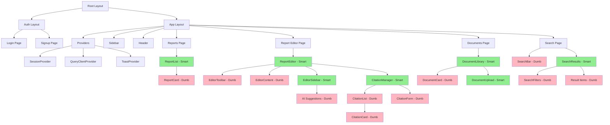
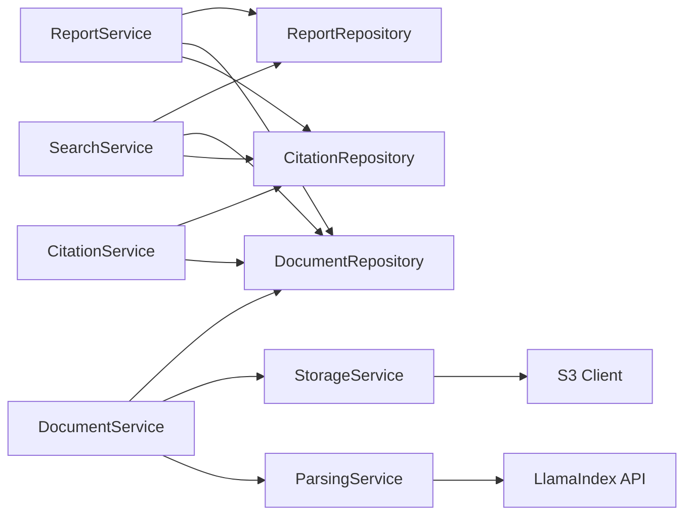
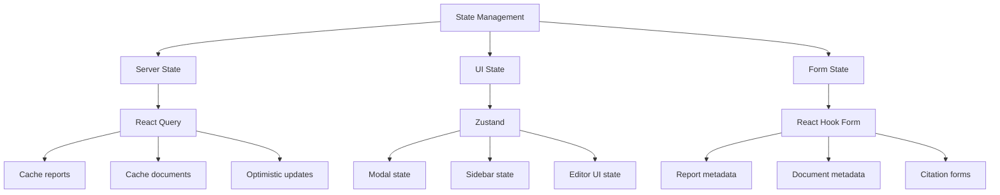

# Component Structure & File Organization

## Table of Contents
1. [File Structure](#file-structure)
2. [Component Hierarchy](#component-hierarchy)
3. [Service Layer Design](#service-layer-design)
4. [Repository Layer Design](#repository-layer-design)
5. [State Management Strategy](#state-management-strategy)
6. [Custom Hooks](#custom-hooks)
7. [Component Examples](#component-examples)

---

## 1. File Structure

### Complete Directory Tree

```
apex/
├── app/                                    # Next.js 14 App Router
│   ├── (auth)/                             # Auth route group (public routes)
│   │   ├── login/
│   │   │   └── page.tsx                    # Login page
│   │   ├── signup/
│   │   │   └── page.tsx                    # Signup page
│   │   └── layout.tsx                      # Auth layout (minimal UI)
│   │
│   ├── (app)/                              # Main app route group (requires auth)
│   │   ├── reports/
│   │   │   ├── page.tsx                    # Report list page
│   │   │   ├── [id]/
│   │   │   │   ├── page.tsx                # Report editor page
│   │   │   │   └── loading.tsx             # Loading UI
│   │   │   └── new/
│   │   │       └── page.tsx                # Create new report
│   │   │
│   │   ├── documents/
│   │   │   ├── page.tsx                    # Document library page
│   │   │   └── [id]/
│   │   │       └── page.tsx                # Document viewer
│   │   │
│   │   ├── search/
│   │   │   └── page.tsx                    # Global search page
│   │   │
│   │   └── layout.tsx                      # App layout (sidebar, providers)
│   │
│   ├── api/                                # API routes (Next.js route handlers)
│   │   ├── auth/
│   │   │   └── [...nextauth]/
│   │   │       └── route.ts                # NextAuth configuration
│   │   │
│   │   ├── reports/
│   │   │   ├── route.ts                    # GET (list), POST (create)
│   │   │   ├── [id]/
│   │   │   │   └── route.ts                # GET, PATCH, DELETE report
│   │   │   └── search/
│   │   │       └── route.ts                # POST search reports
│   │   │
│   │   ├── documents/
│   │   │   ├── route.ts                    # GET (list), POST (upload)
│   │   │   ├── [id]/
│   │   │   │   └── route.ts                # GET, PATCH, DELETE document
│   │   │   ├── parse/
│   │   │   │   └── route.ts                # POST parse document
│   │   │   └── search/
│   │   │       └── route.ts                # POST search documents
│   │   │
│   │   ├── citations/
│   │   │   ├── route.ts                    # GET citations for report
│   │   │   └── validate/
│   │   │       └── route.ts                # POST validate citations
│   │   │
│   │   └── upload/
│   │       └── route.ts                    # POST file upload (S3)
│   │
│   ├── layout.tsx                          # Root layout
│   ├── page.tsx                            # Landing page
│   └── globals.css                         # Global styles
│
├── components/                             # React components (UI only)
│   ├── reports/                            # Report-related UI
│   │   ├── ReportList.tsx                  # Display list of reports
│   │   ├── ReportCard.tsx                  # Single report card
│   │   ├── ReportEditor.tsx                # Smart component: report editor
│   │   ├── ReportToolbar.tsx               # Editor toolbar (formatting)
│   │   ├── ReportMetadata.tsx              # Report metadata form
│   │   └── ReportExportDialog.tsx          # Export options modal
│   │
│   ├── documents/                          # Document-related UI
│   │   ├── DocumentLibrary.tsx             # Document grid/list view
│   │   ├── DocumentCard.tsx                # Single document card
│   │   ├── DocumentUpload.tsx              # Smart component: file upload
│   │   ├── DocumentViewer.tsx              # Document preview/reader
│   │   ├── DocumentMetadataForm.tsx        # Edit document metadata
│   │   └── DocumentSearchBar.tsx           # Document search input
│   │
│   ├── citations/                          # Citation management UI
│   │   ├── CitationManager.tsx             # Smart component: manage citations
│   │   ├── CitationList.tsx                # Display citations
│   │   ├── CitationCard.tsx                # Single citation display
│   │   ├── CitationForm.tsx                # Add/edit citation
│   │   └── CitationValidator.tsx           # Validate citation status
│   │
│   ├── editor/                             # Rich text editor components
│   │   ├── EditorToolbar.tsx               # Formatting toolbar
│   │   ├── EditorContent.tsx               # Main editor area
│   │   ├── EditorSidebar.tsx               # AI suggestions sidebar
│   │   └── EditorStatusBar.tsx             # Word count, save status
│   │
│   ├── search/                             # Search components
│   │   ├── SearchBar.tsx                   # Global search input
│   │   ├── SearchResults.tsx               # Display search results
│   │   ├── SearchFilters.tsx               # Filter options
│   │   └── SearchHighlight.tsx             # Highlight search terms
│   │
│   ├── shared/                             # Shared UI components
│   │   ├── Sidebar.tsx                     # App navigation sidebar
│   │   ├── Header.tsx                      # App header
│   │   ├── LoadingSpinner.tsx              # Loading indicator
│   │   ├── ErrorBoundary.tsx               # Error handling
│   │   ├── EmptyState.tsx                  # Empty state placeholder
│   │   ├── ConfirmDialog.tsx               # Confirmation modal
│   │   └── Toast.tsx                       # Toast notifications
│   │
│   └── ui/                                 # shadcn/ui primitive components
│       ├── button.tsx
│       ├── dialog.tsx
│       ├── dropdown-menu.tsx
│       ├── input.tsx
│       ├── card.tsx
│       ├── badge.tsx
│       ├── tabs.tsx
│       ├── select.tsx
│       └── ...                             # Other shadcn components
│
├── services/                               # Business logic layer (NEW - clean arch)
│   ├── ReportService.ts                    # Report business logic
│   ├── DocumentService.ts                  # Document business logic
│   ├── CitationService.ts                  # Citation business logic
│   ├── SearchService.ts                    # Search business logic
│   ├── AuthService.ts                      # Authentication business logic
│   ├── StorageService.ts                   # File storage (S3) business logic
│   ├── ParsingService.ts                   # Document parsing (LlamaIndex)
│   ├── AIService.ts                        # AI/LLM interactions
│   └── ExportService.ts                    # Report export (PDF, Word)
│
├── repositories/                           # Database access layer (NEW - clean arch)
│   ├── ReportRepository.ts                 # Report CRUD operations
│   ├── DocumentRepository.ts               # Document CRUD operations
│   ├── CitationRepository.ts               # Citation CRUD operations
│   ├── UserRepository.ts                   # User CRUD operations
│   ├── base/
│   │   └── BaseRepository.ts               # Generic repository interface
│   └── types/
│       └── RepositoryTypes.ts              # Repository-specific types
│
├── lib/                                    # Utilities and configurations
│   ├── db.ts                               # Prisma client singleton
│   ├── auth.ts                             # NextAuth configuration
│   ├── validation.ts                       # Zod validation schemas
│   ├── s3.ts                               # S3 client configuration
│   ├── logger.ts                           # Logging utility
│   ├── errors.ts                           # Custom error classes
│   ├── constants.ts                        # App-wide constants
│   └── utils.ts                            # Helper functions
│
├── types/                                  # TypeScript type definitions
│   ├── entities.ts                         # Domain entities (Report, Document, etc.)
│   ├── api.ts                              # API request/response types
│   ├── services.ts                         # Service layer types
│   └── components.ts                       # Component prop types
│
├── hooks/                                  # Custom React hooks
│   ├── useReports.ts                       # Report operations hook
│   ├── useDocuments.ts                     # Document operations hook
│   ├── useCitations.ts                     # Citation operations hook
│   ├── useSearch.ts                        # Search operations hook
│   ├── useAuth.ts                          # Authentication hook
│   ├── useUpload.ts                        # File upload hook
│   └── useDebounce.ts                      # Utility hook for debouncing
│
├── store/                                  # Zustand stores (UI state only)
│   ├── uiStore.ts                          # Global UI state (modals, sidebars)
│   ├── editorStore.ts                      # Editor UI state
│   └── searchStore.ts                      # Search UI state
│
├── config/                                 # Application configuration
│   ├── routes.ts                           # Route constants
│   ├── api.ts                              # API endpoint constants
│   └── features.ts                         # Feature flags
│
├── __tests__/                              # Test files
│   ├── services/                           # Service layer tests
│   ├── repositories/                       # Repository layer tests
│   ├── components/                         # Component tests
│   └── hooks/                              # Hook tests
│
├── prisma/
│   ├── schema.prisma                       # Database schema
│   ├── migrations/                         # Database migrations
│   └── seed.ts                             # Seed data
│
├── public/                                 # Static assets
│   ├── images/
│   └── fonts/
│
├── .env.example                            # Environment variables template
├── .env.local                              # Local environment variables (gitignored)
├── next.config.js                          # Next.js configuration
├── tailwind.config.ts                      # Tailwind CSS configuration
├── tsconfig.json                           # TypeScript configuration
├── package.json                            # Dependencies
└── README.md                               # Project documentation
```

---

## 2. Component Hierarchy

### Component Tree Diagram



**Legend:**
- 🟢 **Green (Smart Components)**: Connected to services via hooks, handle business logic coordination
- 🔴 **Pink (Dumb/Presentational Components)**: Pure UI components, receive data via props

### Component Classification

#### Smart Components (Container Components)
- **Purpose**: Coordinate business logic, manage state, call services
- **Characteristics**:
  - Use custom hooks (useReports, useDocuments, etc.)
  - Handle side effects
  - Minimal UI rendering (mostly composition)
  - Pass data to presentational components

**Examples:**
- `ReportList` - Fetches reports, handles pagination
- `ReportEditor` - Manages report editing, auto-save
- `DocumentUpload` - Handles file selection, upload, parsing
- `CitationManager` - Manages citation CRUD operations
- `SearchResults` - Fetches and displays search results

#### Dumb Components (Presentational Components)
- **Purpose**: Render UI based on props
- **Characteristics**:
  - No business logic
  - No service calls
  - Highly reusable
  - Easy to test

**Examples:**
- `ReportCard` - Displays report information
- `EditorToolbar` - Renders formatting buttons
- `CitationCard` - Displays single citation
- `DocumentCard` - Displays document thumbnail and metadata
- `SearchBar` - Renders search input

---

## 3. Service Layer Design

### Architecture Principle
**Services contain ALL business logic.** Components only call service methods through custom hooks. Services never import React.

### Service Structure

#### ReportService

```typescript
// services/ReportService.ts

import { Report, ReportCreateInput, ReportUpdateInput } from '@/types/entities';
import { ReportRepository } from '@/repositories/ReportRepository';
import { DocumentRepository } from '@/repositories/DocumentRepository';
import { CitationRepository } from '@/repositories/CitationRepository';
import { ValidationError, NotFoundError } from '@/lib/errors';
import { validateReportInput } from '@/lib/validation';
import { logger } from '@/lib/logger';

export class ReportService {
  constructor(
    private reportRepository: ReportRepository,
    private documentRepository: DocumentRepository,
    private citationRepository: CitationRepository
  ) {}

  /**
   * Create a new report
   */
  async createReport(
    userId: string,
    input: ReportCreateInput
  ): Promise<Report> {
    // Validate input
    const validation = validateReportInput(input);
    if (!validation.success) {
      throw new ValidationError('Invalid report data', validation.errors);
    }

    // Business logic: Set initial status and metadata
    const reportData = {
      ...input,
      userId,
      status: 'draft' as const,
      wordCount: 0,
      citationCount: 0,
      createdAt: new Date(),
      updatedAt: new Date(),
    };

    // Delegate to repository
    const report = await this.reportRepository.create(reportData);

    logger.info(`Report created: ${report.id}`, { userId, reportId: report.id });

    return report;
  }

  /**
   * Update a report
   */
  async updateReport(
    reportId: string,
    userId: string,
    input: ReportUpdateInput
  ): Promise<Report> {
    // Check ownership
    const existingReport = await this.reportRepository.findById(reportId);
    if (!existingReport) {
      throw new NotFoundError('Report not found');
    }
    if (existingReport.userId !== userId) {
      throw new ValidationError('Unauthorized to update this report');
    }

    // Business logic: Update word count if content changed
    let wordCount = existingReport.wordCount;
    if (input.content) {
      wordCount = this.calculateWordCount(input.content);
    }

    // Business logic: Update citation count
    let citationCount = existingReport.citationCount;
    if (input.content) {
      const citations = await this.citationRepository.findByReportId(reportId);
      citationCount = citations.length;
    }

    const updateData = {
      ...input,
      wordCount,
      citationCount,
      updatedAt: new Date(),
    };

    const updatedReport = await this.reportRepository.update(
      reportId,
      updateData
    );

    logger.info(`Report updated: ${reportId}`, { userId, reportId });

    return updatedReport;
  }

  /**
   * Delete a report
   */
  async deleteReport(reportId: string, userId: string): Promise<void> {
    // Check ownership
    const report = await this.reportRepository.findById(reportId);
    if (!report) {
      throw new NotFoundError('Report not found');
    }
    if (report.userId !== userId) {
      throw new ValidationError('Unauthorized to delete this report');
    }

    // Business logic: Cascade delete citations
    await this.citationRepository.deleteByReportId(reportId);

    // Delete report
    await this.reportRepository.delete(reportId);

    logger.info(`Report deleted: ${reportId}`, { userId, reportId });
  }

  /**
   * List reports for a user
   */
  async listReports(
    userId: string,
    options?: {
      page?: number;
      limit?: number;
      status?: Report['status'];
      sortBy?: 'createdAt' | 'updatedAt' | 'title';
      sortOrder?: 'asc' | 'desc';
    }
  ): Promise<{ reports: Report[]; total: number; page: number; limit: number }> {
    const page = options?.page ?? 1;
    const limit = options?.limit ?? 20;
    const offset = (page - 1) * limit;

    const { reports, total } = await this.reportRepository.findByUserId(
      userId,
      {
        offset,
        limit,
        status: options?.status,
        sortBy: options?.sortBy ?? 'updatedAt',
        sortOrder: options?.sortOrder ?? 'desc',
      }
    );

    return { reports, total, page, limit };
  }

  /**
   * Search reports
   */
  async searchReports(
    userId: string,
    query: string,
    options?: {
      page?: number;
      limit?: number;
      filters?: {
        status?: Report['status'];
        dateFrom?: Date;
        dateTo?: Date;
      };
    }
  ): Promise<{ reports: Report[]; total: number }> {
    const page = options?.page ?? 1;
    const limit = options?.limit ?? 20;
    const offset = (page - 1) * limit;

    return await this.reportRepository.search(userId, query, {
      offset,
      limit,
      filters: options?.filters,
    });
  }

  /**
   * Get report by ID
   */
  async getReportById(reportId: string, userId: string): Promise<Report> {
    const report = await this.reportRepository.findById(reportId);

    if (!report) {
      throw new NotFoundError('Report not found');
    }

    // Business logic: Check access permissions
    if (report.userId !== userId && !report.isPublic) {
      throw new ValidationError('Unauthorized to access this report');
    }

    return report;
  }

  /**
   * Add document to report
   */
  async addDocumentToReport(
    reportId: string,
    userId: string,
    documentId: string
  ): Promise<void> {
    // Verify ownership
    const report = await this.getReportById(reportId, userId);

    // Verify document exists and user has access
    const document = await this.documentRepository.findById(documentId);
    if (!document || document.userId !== userId) {
      throw new NotFoundError('Document not found');
    }

    // Business logic: Link document to report
    await this.reportRepository.addDocument(reportId, documentId);

    logger.info(`Document ${documentId} added to report ${reportId}`);
  }

  /**
   * Calculate word count
   */
  private calculateWordCount(content: string): number {
    // Remove markdown formatting and count words
    const plainText = content.replace(/[#*_`~\[\]()]/g, '');
    const words = plainText.trim().split(/\s+/);
    return words.filter((word) => word.length > 0).length;
  }
}

// Export singleton instance with dependency injection
export const createReportService = () => {
  const reportRepository = new ReportRepository();
  const documentRepository = new DocumentRepository();
  const citationRepository = new CitationRepository();

  return new ReportService(
    reportRepository,
    documentRepository,
    citationRepository
  );
};
```

#### DocumentService

```typescript
// services/DocumentService.ts

import { Document, DocumentCreateInput, DocumentUpdateInput } from '@/types/entities';
import { DocumentRepository } from '@/repositories/DocumentRepository';
import { StorageService } from './StorageService';
import { ParsingService } from './ParsingService';
import { ValidationError, NotFoundError } from '@/lib/errors';
import { logger } from '@/lib/logger';

export class DocumentService {
  constructor(
    private documentRepository: DocumentRepository,
    private storageService: StorageService,
    private parsingService: ParsingService
  ) {}

  /**
   * Upload and create a new document
   */
  async uploadDocument(
    userId: string,
    file: File,
    metadata?: Partial<DocumentCreateInput>
  ): Promise<Document> {
    // Validate file
    this.validateFile(file);

    // Upload to S3
    const { url, key } = await this.storageService.uploadFile(file, {
      folder: `documents/${userId}`,
    });

    // Create document record
    const documentData: DocumentCreateInput = {
      userId,
      name: metadata?.name ?? file.name,
      fileType: file.type,
      fileSize: file.size,
      url,
      storageKey: key,
      status: 'pending',
      tags: metadata?.tags ?? [],
      notes: metadata?.notes,
    };

    const document = await this.documentRepository.create(documentData);

    // Start async parsing
    this.parseDocumentAsync(document.id, url);

    logger.info(`Document uploaded: ${document.id}`, { userId, documentId: document.id });

    return document;
  }

  /**
   * Parse a document (async)
   */
  private async parseDocumentAsync(documentId: string, url: string): Promise<void> {
    try {
      // Update status to processing
      await this.documentRepository.update(documentId, { status: 'processing' });

      // Parse document
      const parsedContent = await this.parsingService.parseDocument(url);

      // Update document with parsed content
      await this.documentRepository.update(documentId, {
        content: parsedContent.text,
        metadata: parsedContent.metadata,
        status: 'ready',
      });

      logger.info(`Document parsed successfully: ${documentId}`);
    } catch (error) {
      logger.error(`Document parsing failed: ${documentId}`, error);

      await this.documentRepository.update(documentId, {
        status: 'error',
        error: error instanceof Error ? error.message : 'Unknown error',
      });
    }
  }

  /**
   * Update document metadata
   */
  async updateDocument(
    documentId: string,
    userId: string,
    input: DocumentUpdateInput
  ): Promise<Document> {
    // Check ownership
    const existingDoc = await this.documentRepository.findById(documentId);
    if (!existingDoc) {
      throw new NotFoundError('Document not found');
    }
    if (existingDoc.userId !== userId) {
      throw new ValidationError('Unauthorized to update this document');
    }

    const updatedDoc = await this.documentRepository.update(documentId, {
      ...input,
      updatedAt: new Date(),
    });

    return updatedDoc;
  }

  /**
   * Delete document
   */
  async deleteDocument(documentId: string, userId: string): Promise<void> {
    const document = await this.documentRepository.findById(documentId);
    if (!document) {
      throw new NotFoundError('Document not found');
    }
    if (document.userId !== userId) {
      throw new ValidationError('Unauthorized to delete this document');
    }

    // Delete from S3
    await this.storageService.deleteFile(document.storageKey);

    // Delete from database
    await this.documentRepository.delete(documentId);

    logger.info(`Document deleted: ${documentId}`);
  }

  /**
   * List documents
   */
  async listDocuments(
    userId: string,
    options?: {
      page?: number;
      limit?: number;
      tags?: string[];
      status?: Document['status'];
    }
  ): Promise<{ documents: Document[]; total: number }> {
    const page = options?.page ?? 1;
    const limit = options?.limit ?? 20;
    const offset = (page - 1) * limit;

    return await this.documentRepository.findByUserId(userId, {
      offset,
      limit,
      tags: options?.tags,
      status: options?.status,
    });
  }

  /**
   * Search documents
   */
  async searchDocuments(
    userId: string,
    query: string,
    options?: {
      page?: number;
      limit?: number;
    }
  ): Promise<{ documents: Document[]; total: number }> {
    const page = options?.page ?? 1;
    const limit = options?.limit ?? 20;
    const offset = (page - 1) * limit;

    return await this.documentRepository.search(userId, query, {
      offset,
      limit,
    });
  }

  /**
   * Validate file before upload
   */
  private validateFile(file: File): void {
    const MAX_FILE_SIZE = 50 * 1024 * 1024; // 50MB
    const ALLOWED_TYPES = [
      'application/pdf',
      'application/msword',
      'application/vnd.openxmlformats-officedocument.wordprocessingml.document',
      'text/plain',
      'text/markdown',
    ];

    if (file.size > MAX_FILE_SIZE) {
      throw new ValidationError('File size exceeds 50MB limit');
    }

    if (!ALLOWED_TYPES.includes(file.type)) {
      throw new ValidationError('File type not supported');
    }
  }
}

// Export factory function
export const createDocumentService = () => {
  const documentRepository = new DocumentRepository();
  const storageService = new StorageService();
  const parsingService = new ParsingService();

  return new DocumentService(
    documentRepository,
    storageService,
    parsingService
  );
};
```

#### Service Dependencies



---

## 4. Repository Layer Design

### Architecture Principle
**Repositories handle ONLY database operations.** No business logic. Pure data access.

### Base Repository

```typescript
// repositories/base/BaseRepository.ts

import { PrismaClient } from '@prisma/client';
import { db } from '@/lib/db';

export abstract class BaseRepository<T> {
  protected db: PrismaClient;

  constructor() {
    this.db = db;
  }

  abstract create(data: unknown): Promise<T>;
  abstract findById(id: string): Promise<T | null>;
  abstract update(id: string, data: unknown): Promise<T>;
  abstract delete(id: string): Promise<void>;
}
```

### ReportRepository

```typescript
// repositories/ReportRepository.ts

import { Report, Prisma } from '@prisma/client';
import { BaseRepository } from './base/BaseRepository';
import { logger } from '@/lib/logger';

export class ReportRepository extends BaseRepository<Report> {
  /**
   * Create a new report
   */
  async create(data: Prisma.ReportCreateInput): Promise<Report> {
    try {
      return await this.db.report.create({ data });
    } catch (error) {
      logger.error('Failed to create report', error);
      throw error;
    }
  }

  /**
   * Find report by ID
   */
  async findById(id: string): Promise<Report | null> {
    try {
      return await this.db.report.findUnique({
        where: { id },
        include: {
          documents: true,
          citations: true,
        },
      });
    } catch (error) {
      logger.error(`Failed to find report: ${id}`, error);
      throw error;
    }
  }

  /**
   * Update report
   */
  async update(id: string, data: Prisma.ReportUpdateInput): Promise<Report> {
    try {
      return await this.db.report.update({
        where: { id },
        data,
      });
    } catch (error) {
      logger.error(`Failed to update report: ${id}`, error);
      throw error;
    }
  }

  /**
   * Delete report
   */
  async delete(id: string): Promise<void> {
    try {
      await this.db.report.delete({ where: { id } });
    } catch (error) {
      logger.error(`Failed to delete report: ${id}`, error);
      throw error;
    }
  }

  /**
   * Find reports by user ID with pagination
   */
  async findByUserId(
    userId: string,
    options: {
      offset: number;
      limit: number;
      status?: Report['status'];
      sortBy?: string;
      sortOrder?: 'asc' | 'desc';
    }
  ): Promise<{ reports: Report[]; total: number }> {
    try {
      const where: Prisma.ReportWhereInput = {
        userId,
        ...(options.status && { status: options.status }),
      };

      const [reports, total] = await Promise.all([
        this.db.report.findMany({
          where,
          skip: options.offset,
          take: options.limit,
          orderBy: {
            [options.sortBy ?? 'updatedAt']: options.sortOrder ?? 'desc',
          },
          include: {
            _count: {
              select: { documents: true, citations: true },
            },
          },
        }),
        this.db.report.count({ where }),
      ]);

      return { reports, total };
    } catch (error) {
      logger.error('Failed to find reports by user', error);
      throw error;
    }
  }

  /**
   * Search reports
   */
  async search(
    userId: string,
    query: string,
    options: {
      offset: number;
      limit: number;
      filters?: {
        status?: Report['status'];
        dateFrom?: Date;
        dateTo?: Date;
      };
    }
  ): Promise<{ reports: Report[]; total: number }> {
    try {
      const where: Prisma.ReportWhereInput = {
        userId,
        OR: [
          { title: { contains: query, mode: 'insensitive' } },
          { content: { contains: query, mode: 'insensitive' } },
          { abstract: { contains: query, mode: 'insensitive' } },
        ],
        ...(options.filters?.status && { status: options.filters.status }),
        ...(options.filters?.dateFrom && {
          createdAt: { gte: options.filters.dateFrom },
        }),
        ...(options.filters?.dateTo && {
          createdAt: { lte: options.filters.dateTo },
        }),
      };

      const [reports, total] = await Promise.all([
        this.db.report.findMany({
          where,
          skip: options.offset,
          take: options.limit,
          orderBy: { updatedAt: 'desc' },
        }),
        this.db.report.count({ where }),
      ]);

      return { reports, total };
    } catch (error) {
      logger.error('Failed to search reports', error);
      throw error;
    }
  }

  /**
   * Add document to report
   */
  async addDocument(reportId: string, documentId: string): Promise<void> {
    try {
      await this.db.report.update({
        where: { id: reportId },
        data: {
          documents: {
            connect: { id: documentId },
          },
        },
      });
    } catch (error) {
      logger.error('Failed to add document to report', error);
      throw error;
    }
  }

  /**
   * Remove document from report
   */
  async removeDocument(reportId: string, documentId: string): Promise<void> {
    try {
      await this.db.report.update({
        where: { id: reportId },
        data: {
          documents: {
            disconnect: { id: documentId },
          },
        },
      });
    } catch (error) {
      logger.error('Failed to remove document from report', error);
      throw error;
    }
  }
}
```

### DocumentRepository

```typescript
// repositories/DocumentRepository.ts

import { Document, Prisma } from '@prisma/client';
import { BaseRepository } from './base/BaseRepository';
import { logger } from '@/lib/logger';

export class DocumentRepository extends BaseRepository<Document> {
  /**
   * Create a new document
   */
  async create(data: Prisma.DocumentCreateInput): Promise<Document> {
    try {
      return await this.db.document.create({ data });
    } catch (error) {
      logger.error('Failed to create document', error);
      throw error;
    }
  }

  /**
   * Find document by ID
   */
  async findById(id: string): Promise<Document | null> {
    try {
      return await this.db.document.findUnique({
        where: { id },
        include: {
          reports: true,
        },
      });
    } catch (error) {
      logger.error(`Failed to find document: ${id}`, error);
      throw error;
    }
  }

  /**
   * Update document
   */
  async update(id: string, data: Prisma.DocumentUpdateInput): Promise<Document> {
    try {
      return await this.db.document.update({
        where: { id },
        data,
      });
    } catch (error) {
      logger.error(`Failed to update document: ${id}`, error);
      throw error;
    }
  }

  /**
   * Delete document
   */
  async delete(id: string): Promise<void> {
    try {
      await this.db.document.delete({ where: { id } });
    } catch (error) {
      logger.error(`Failed to delete document: ${id}`, error);
      throw error;
    }
  }

  /**
   * Find documents by user ID
   */
  async findByUserId(
    userId: string,
    options: {
      offset: number;
      limit: number;
      tags?: string[];
      status?: Document['status'];
    }
  ): Promise<{ documents: Document[]; total: number }> {
    try {
      const where: Prisma.DocumentWhereInput = {
        userId,
        ...(options.tags && { tags: { hasSome: options.tags } }),
        ...(options.status && { status: options.status }),
      };

      const [documents, total] = await Promise.all([
        this.db.document.findMany({
          where,
          skip: options.offset,
          take: options.limit,
          orderBy: { createdAt: 'desc' },
        }),
        this.db.document.count({ where }),
      ]);

      return { documents, total };
    } catch (error) {
      logger.error('Failed to find documents by user', error);
      throw error;
    }
  }

  /**
   * Search documents
   */
  async search(
    userId: string,
    query: string,
    options: {
      offset: number;
      limit: number;
    }
  ): Promise<{ documents: Document[]; total: number }> {
    try {
      const where: Prisma.DocumentWhereInput = {
        userId,
        OR: [
          { name: { contains: query, mode: 'insensitive' } },
          { content: { contains: query, mode: 'insensitive' } },
          { notes: { contains: query, mode: 'insensitive' } },
        ],
      };

      const [documents, total] = await Promise.all([
        this.db.document.findMany({
          where,
          skip: options.offset,
          take: options.limit,
          orderBy: { createdAt: 'desc' },
        }),
        this.db.document.count({ where }),
      ]);

      return { documents, total };
    } catch (error) {
      logger.error('Failed to search documents', error);
      throw error;
    }
  }
}
```

---

## 5. State Management Strategy

### Three-Tier State Management



### 1. Server State (React Query)

**Purpose**: Cache and synchronize server data

```typescript
// hooks/useReports.ts

import { useQuery, useMutation, useQueryClient } from '@tanstack/react-query';
import { createReportService } from '@/services/ReportService';
import { Report, ReportCreateInput, ReportUpdateInput } from '@/types/entities';

const reportService = createReportService();

// Query keys
export const reportKeys = {
  all: ['reports'] as const,
  lists: () => [...reportKeys.all, 'list'] as const,
  list: (filters: string) => [...reportKeys.lists(), filters] as const,
  details: () => [...reportKeys.all, 'detail'] as const,
  detail: (id: string) => [...reportKeys.details(), id] as const,
};

/**
 * Fetch all reports for current user
 */
export function useReports(userId: string, options?: {
  page?: number;
  limit?: number;
  status?: Report['status'];
}) {
  return useQuery({
    queryKey: reportKeys.list(JSON.stringify(options)),
    queryFn: () => reportService.listReports(userId, options),
    staleTime: 5 * 60 * 1000, // 5 minutes
  });
}

/**
 * Fetch single report
 */
export function useReport(reportId: string, userId: string) {
  return useQuery({
    queryKey: reportKeys.detail(reportId),
    queryFn: () => reportService.getReportById(reportId, userId),
    staleTime: 5 * 60 * 1000,
  });
}

/**
 * Create report mutation
 */
export function useCreateReport() {
  const queryClient = useQueryClient();

  return useMutation({
    mutationFn: ({ userId, data }: { userId: string; data: ReportCreateInput }) =>
      reportService.createReport(userId, data),
    onSuccess: () => {
      // Invalidate reports list to refetch
      queryClient.invalidateQueries({ queryKey: reportKeys.lists() });
    },
  });
}

/**
 * Update report mutation with optimistic updates
 */
export function useUpdateReport() {
  const queryClient = useQueryClient();

  return useMutation({
    mutationFn: ({
      reportId,
      userId,
      data,
    }: {
      reportId: string;
      userId: string;
      data: ReportUpdateInput;
    }) => reportService.updateReport(reportId, userId, data),

    // Optimistic update
    onMutate: async ({ reportId, data }) => {
      // Cancel outgoing refetches
      await queryClient.cancelQueries({ queryKey: reportKeys.detail(reportId) });

      // Snapshot previous value
      const previousReport = queryClient.getQueryData<Report>(
        reportKeys.detail(reportId)
      );

      // Optimistically update
      if (previousReport) {
        queryClient.setQueryData<Report>(reportKeys.detail(reportId), {
          ...previousReport,
          ...data,
        });
      }

      return { previousReport };
    },

    // Rollback on error
    onError: (err, { reportId }, context) => {
      if (context?.previousReport) {
        queryClient.setQueryData(
          reportKeys.detail(reportId),
          context.previousReport
        );
      }
    },

    // Always refetch after error or success
    onSettled: (data, error, { reportId }) => {
      queryClient.invalidateQueries({ queryKey: reportKeys.detail(reportId) });
    },
  });
}

/**
 * Delete report mutation
 */
export function useDeleteReport() {
  const queryClient = useQueryClient();

  return useMutation({
    mutationFn: ({ reportId, userId }: { reportId: string; userId: string }) =>
      reportService.deleteReport(reportId, userId),
    onSuccess: () => {
      queryClient.invalidateQueries({ queryKey: reportKeys.lists() });
    },
  });
}
```

### 2. UI State (Zustand)

**Purpose**: Manage global UI state (modals, sidebars, etc.)

```typescript
// store/uiStore.ts

import { create } from 'zustand';
import { devtools } from 'zustand/middleware';

interface UIState {
  // Sidebar
  sidebarOpen: boolean;
  setSidebarOpen: (open: boolean) => void;
  toggleSidebar: () => void;

  // Modals
  activeModal: string | null;
  openModal: (modalId: string) => void;
  closeModal: () => void;

  // Notifications
  notifications: Array<{
    id: string;
    type: 'success' | 'error' | 'info';
    message: string;
  }>;
  addNotification: (notification: Omit<UIState['notifications'][0], 'id'>) => void;
  removeNotification: (id: string) => void;
}

export const useUIStore = create<UIState>()(
  devtools(
    (set) => ({
      // Sidebar state
      sidebarOpen: true,
      setSidebarOpen: (open) => set({ sidebarOpen: open }),
      toggleSidebar: () => set((state) => ({ sidebarOpen: !state.sidebarOpen })),

      // Modal state
      activeModal: null,
      openModal: (modalId) => set({ activeModal: modalId }),
      closeModal: () => set({ activeModal: null }),

      // Notifications
      notifications: [],
      addNotification: (notification) =>
        set((state) => ({
          notifications: [
            ...state.notifications,
            { ...notification, id: crypto.randomUUID() },
          ],
        })),
      removeNotification: (id) =>
        set((state) => ({
          notifications: state.notifications.filter((n) => n.id !== id),
        })),
    }),
    { name: 'ui-store' }
  )
);
```

```typescript
// store/editorStore.ts

import { create } from 'zustand';
import { devtools } from 'zustand/middleware';

interface EditorState {
  // Editor UI
  showAISidebar: boolean;
  showCitationPanel: boolean;
  toggleAISidebar: () => void;
  toggleCitationPanel: () => void;

  // Formatting toolbar
  toolbarPosition: 'top' | 'floating';
  setToolbarPosition: (position: 'top' | 'floating') => void;

  // Focus mode
  focusMode: boolean;
  toggleFocusMode: () => void;
}

export const useEditorStore = create<EditorState>()(
  devtools(
    (set) => ({
      showAISidebar: true,
      showCitationPanel: false,
      toggleAISidebar: () =>
        set((state) => ({ showAISidebar: !state.showAISidebar })),
      toggleCitationPanel: () =>
        set((state) => ({ showCitationPanel: !state.showCitationPanel })),

      toolbarPosition: 'top',
      setToolbarPosition: (position) => set({ toolbarPosition: position }),

      focusMode: false,
      toggleFocusMode: () => set((state) => ({ focusMode: !state.focusMode })),
    }),
    { name: 'editor-store' }
  )
);
```

### 3. Form State (React Hook Form)

**Purpose**: Manage form state, validation, submission

```typescript
// components/reports/ReportMetadataForm.tsx

import { useForm } from 'react-hook-form';
import { zodResolver } from '@hookform/resolvers/zod';
import { z } from 'zod';
import { ReportUpdateInput } from '@/types/entities';

const reportMetadataSchema = z.object({
  title: z.string().min(1, 'Title is required').max(200),
  abstract: z.string().max(500).optional(),
  tags: z.array(z.string()).optional(),
  isPublic: z.boolean(),
});

type ReportMetadataFormData = z.infer<typeof reportMetadataSchema>;

interface ReportMetadataFormProps {
  initialData?: Partial<ReportMetadataFormData>;
  onSubmit: (data: ReportMetadataFormData) => Promise<void>;
}

export function ReportMetadataForm({
  initialData,
  onSubmit,
}: ReportMetadataFormProps) {
  const {
    register,
    handleSubmit,
    formState: { errors, isSubmitting },
  } = useForm<ReportMetadataFormData>({
    resolver: zodResolver(reportMetadataSchema),
    defaultValues: initialData,
  });

  return (
    <form onSubmit={handleSubmit(onSubmit)} className="space-y-4">
      <div>
        <label htmlFor="title" className="block text-sm font-medium">
          Title
        </label>
        <input
          {...register('title')}
          type="text"
          className="mt-1 block w-full rounded-md border-gray-300"
        />
        {errors.title && (
          <p className="mt-1 text-sm text-red-600">{errors.title.message}</p>
        )}
      </div>

      <div>
        <label htmlFor="abstract" className="block text-sm font-medium">
          Abstract
        </label>
        <textarea
          {...register('abstract')}
          rows={4}
          className="mt-1 block w-full rounded-md border-gray-300"
        />
        {errors.abstract && (
          <p className="mt-1 text-sm text-red-600">{errors.abstract.message}</p>
        )}
      </div>

      <div className="flex items-center">
        <input
          {...register('isPublic')}
          type="checkbox"
          className="h-4 w-4 rounded border-gray-300"
        />
        <label htmlFor="isPublic" className="ml-2 block text-sm">
          Make this report public
        </label>
      </div>

      <button
        type="submit"
        disabled={isSubmitting}
        className="rounded-md bg-blue-600 px-4 py-2 text-white disabled:opacity-50"
      >
        {isSubmitting ? 'Saving...' : 'Save Changes'}
      </button>
    </form>
  );
}
```

### Why Separate Business Logic from Context?

**Context for State Only**:
```typescript
// ✅ Context manages state only
const UIContext = createContext({
  sidebarOpen: false,
  toggleSidebar: () => {},
});
```

**Services for Business Logic**:
```typescript
// ✅ Service handles business logic
class DocumentService {
  async uploadDocument(file: File) {
    // Business logic here: validation, upload, parsing, etc.
  }
}
```

**Hooks Bridge UI and Services**:
```typescript
// ✅ Hook wraps service
function useDocuments() {
  const mutation = useMutation({
    mutationFn: (file: File) => documentService.uploadDocument(file),
  });
  return mutation;
}
```

**Components Focus on UI**:
```typescript
// ✅ Component just calls hook
function DocumentUpload() {
  const { mutate: upload } = useDocuments();
  return <button onClick={() => upload(file)}>Upload</button>;
}
```

**Benefits**:
- Business logic testable without React
- Services reusable in API routes, CLI tools, etc.
- Components remain simple and focused on UI
- Clear separation makes codebase maintainable

---

## 6. Custom Hooks

### Hook Pattern: Component → Hook → Service → Repository → Database

```typescript
// hooks/useDocuments.ts

import { useQuery, useMutation, useQueryClient } from '@tanstack/react-query';
import { createDocumentService } from '@/services/DocumentService';
import { Document, DocumentUpdateInput } from '@/types/entities';

const documentService = createDocumentService();

// Query keys
export const documentKeys = {
  all: ['documents'] as const,
  lists: () => [...documentKeys.all, 'list'] as const,
  list: (filters: string) => [...documentKeys.lists(), filters] as const,
  details: () => [...documentKeys.all, 'detail'] as const,
  detail: (id: string) => [...documentKeys.details(), id] as const,
};

/**
 * Fetch all documents for current user
 */
export function useDocuments(
  userId: string,
  options?: {
    page?: number;
    limit?: number;
    tags?: string[];
    status?: Document['status'];
  }
) {
  return useQuery({
    queryKey: documentKeys.list(JSON.stringify(options)),
    queryFn: () => documentService.listDocuments(userId, options),
    staleTime: 5 * 60 * 1000,
  });
}

/**
 * Fetch single document
 */
export function useDocument(documentId: string) {
  return useQuery({
    queryKey: documentKeys.detail(documentId),
    queryFn: () => documentService.getDocumentById(documentId),
    staleTime: 5 * 60 * 1000,
  });
}

/**
 * Upload document mutation
 */
export function useUploadDocument() {
  const queryClient = useQueryClient();

  return useMutation({
    mutationFn: ({
      userId,
      file,
      metadata,
    }: {
      userId: string;
      file: File;
      metadata?: Partial<Document>;
    }) => documentService.uploadDocument(userId, file, metadata),

    onSuccess: (newDocument) => {
      // Add to cache optimistically
      queryClient.setQueryData<Document>(
        documentKeys.detail(newDocument.id),
        newDocument
      );

      // Invalidate lists
      queryClient.invalidateQueries({ queryKey: documentKeys.lists() });
    },
  });
}

/**
 * Update document mutation
 */
export function useUpdateDocument() {
  const queryClient = useQueryClient();

  return useMutation({
    mutationFn: ({
      documentId,
      userId,
      data,
    }: {
      documentId: string;
      userId: string;
      data: DocumentUpdateInput;
    }) => documentService.updateDocument(documentId, userId, data),

    onSuccess: (updatedDoc) => {
      queryClient.setQueryData(documentKeys.detail(updatedDoc.id), updatedDoc);
      queryClient.invalidateQueries({ queryKey: documentKeys.lists() });
    },
  });
}

/**
 * Delete document mutation
 */
export function useDeleteDocument() {
  const queryClient = useQueryClient();

  return useMutation({
    mutationFn: ({
      documentId,
      userId,
    }: {
      documentId: string;
      userId: string;
    }) => documentService.deleteDocument(documentId, userId),

    onSuccess: (_, { documentId }) => {
      queryClient.removeQueries({ queryKey: documentKeys.detail(documentId) });
      queryClient.invalidateQueries({ queryKey: documentKeys.lists() });
    },
  });
}

/**
 * Search documents
 */
export function useSearchDocuments(userId: string, query: string) {
  return useQuery({
    queryKey: [...documentKeys.all, 'search', query],
    queryFn: () => documentService.searchDocuments(userId, query),
    enabled: query.length > 0,
    staleTime: 1 * 60 * 1000, // 1 minute
  });
}
```

```typescript
// hooks/useAuth.ts

import { useSession } from 'next-auth/react';

/**
 * Get current user session
 */
export function useAuth() {
  const { data: session, status } = useSession();

  return {
    user: session?.user ?? null,
    isAuthenticated: status === 'authenticated',
    isLoading: status === 'loading',
  };
}

/**
 * Require authentication (throws if not authenticated)
 */
export function useRequireAuth() {
  const { user, isAuthenticated, isLoading } = useAuth();

  if (!isLoading && !isAuthenticated) {
    throw new Error('Authentication required');
  }

  return { user: user!, isLoading };
}
```

```typescript
// hooks/useDebounce.ts

import { useEffect, useState } from 'react';

/**
 * Debounce a value
 */
export function useDebounce<T>(value: T, delay: number = 300): T {
  const [debouncedValue, setDebouncedValue] = useState<T>(value);

  useEffect(() => {
    const handler = setTimeout(() => {
      setDebouncedValue(value);
    }, delay);

    return () => {
      clearTimeout(handler);
    };
  }, [value, delay]);

  return debouncedValue;
}
```

---

## 7. Component Examples

### Smart Component: ReportEditor

```typescript
// components/reports/ReportEditor.tsx
'use client';

import { useState } from 'react';
import { useRouter } from 'next/navigation';
import { useReport, useUpdateReport } from '@/hooks/useReports';
import { useAuth } from '@/hooks/useAuth';
import { useDebounce } from '@/hooks/useDebounce';
import { useEditorStore } from '@/store/editorStore';
import { EditorToolbar } from '@/components/editor/EditorToolbar';
import { EditorContent } from '@/components/editor/EditorContent';
import { EditorSidebar } from '@/components/editor/EditorSidebar';
import { CitationManager } from '@/components/citations/CitationManager';
import { LoadingSpinner } from '@/components/shared/LoadingSpinner';

interface ReportEditorProps {
  reportId: string;
}

/**
 * Smart component: Coordinates report editing
 * - Fetches report data
 * - Handles auto-save
 * - Manages editor UI state
 * - Delegates to presentational components
 */
export function ReportEditor({ reportId }: ReportEditorProps) {
  const router = useRouter();
  const { user } = useAuth();

  // Fetch report data
  const { data: report, isLoading, error } = useReport(reportId, user!.id);

  // Update mutation
  const { mutate: updateReport } = useUpdateReport();

  // Local content state
  const [content, setContent] = useState('');
  const debouncedContent = useDebounce(content, 1000);

  // Editor UI state
  const { showAISidebar, showCitationPanel, toggleAISidebar } = useEditorStore();

  // Auto-save effect
  useEffect(() => {
    if (debouncedContent && debouncedContent !== report?.content) {
      updateReport({
        reportId,
        userId: user!.id,
        data: { content: debouncedContent },
      });
    }
  }, [debouncedContent]);

  // Initialize content when report loads
  useEffect(() => {
    if (report?.content) {
      setContent(report.content);
    }
  }, [report?.content]);

  if (isLoading) {
    return (
      <div className="flex h-screen items-center justify-center">
        <LoadingSpinner />
      </div>
    );
  }

  if (error || !report) {
    return <div>Error loading report</div>;
  }

  return (
    <div className="flex h-screen flex-col">
      {/* Toolbar - presentational component */}
      <EditorToolbar
        onBoldClick={() => {
          /* formatting logic */
        }}
        onItalicClick={() => {
          /* formatting logic */
        }}
        onToggleSidebar={toggleAISidebar}
      />

      <div className="flex flex-1 overflow-hidden">
        {/* Main editor - presentational component */}
        <div className="flex-1 overflow-y-auto">
          <EditorContent value={content} onChange={setContent} />
        </div>

        {/* AI sidebar - smart component */}
        {showAISidebar && (
          <EditorSidebar reportId={reportId} currentContent={content} />
        )}

        {/* Citation panel - smart component */}
        {showCitationPanel && <CitationManager reportId={reportId} />}
      </div>
    </div>
  );
}
```

### Presentational Component: ReportCard

```typescript
// components/reports/ReportCard.tsx

import { Report } from '@/types/entities';
import { Card } from '@/components/ui/card';
import { Badge } from '@/components/ui/badge';
import { formatDate } from '@/lib/utils';

interface ReportCardProps {
  report: Report;
  onClick?: () => void;
}

/**
 * Presentational component: Displays report information
 * - No business logic
 * - No service calls
 * - Pure UI based on props
 */
export function ReportCard({ report, onClick }: ReportCardProps) {
  return (
    <Card
      className="cursor-pointer p-4 transition-shadow hover:shadow-lg"
      onClick={onClick}
    >
      {/* Status badge */}
      <div className="mb-2 flex items-center justify-between">
        <Badge
          variant={
            report.status === 'published'
              ? 'success'
              : report.status === 'draft'
                ? 'warning'
                : 'default'
          }
        >
          {report.status}
        </Badge>
        <span className="text-sm text-gray-500">
          {formatDate(report.updatedAt)}
        </span>
      </div>

      {/* Title */}
      <h3 className="mb-2 text-lg font-semibold">{report.title}</h3>

      {/* Abstract */}
      {report.abstract && (
        <p className="mb-4 line-clamp-2 text-sm text-gray-600">
          {report.abstract}
        </p>
      )}

      {/* Metadata */}
      <div className="flex items-center gap-4 text-sm text-gray-500">
        <span>{report.wordCount} words</span>
        <span>{report.citationCount} citations</span>
        <span>{report.documentCount} documents</span>
      </div>
    </Card>
  );
}
```

### Smart Component: DocumentUpload

```typescript
// components/documents/DocumentUpload.tsx
'use client';

import { useState, useCallback } from 'react';
import { useDropzone } from 'react-dropzone';
import { useUploadDocument } from '@/hooks/useDocuments';
import { useAuth } from '@/hooks/useAuth';
import { useUIStore } from '@/store/uiStore';
import { Button } from '@/components/ui/button';
import { LoadingSpinner } from '@/components/shared/LoadingSpinner';

/**
 * Smart component: Handles document upload
 * - File selection via dropzone
 * - Calls DocumentService via hook
 * - Shows upload progress
 * - Handles errors
 */
export function DocumentUpload() {
  const { user } = useAuth();
  const { mutate: uploadDocument, isPending } = useUploadDocument();
  const { addNotification } = useUIStore();

  const [selectedFile, setSelectedFile] = useState<File | null>(null);

  const onDrop = useCallback((acceptedFiles: File[]) => {
    if (acceptedFiles.length > 0) {
      setSelectedFile(acceptedFiles[0]);
    }
  }, []);

  const { getRootProps, getInputProps, isDragActive } = useDropzone({
    onDrop,
    accept: {
      'application/pdf': ['.pdf'],
      'application/msword': ['.doc'],
      'application/vnd.openxmlformats-officedocument.wordprocessingml.document':
        ['.docx'],
      'text/plain': ['.txt'],
      'text/markdown': ['.md'],
    },
    maxSize: 50 * 1024 * 1024, // 50MB
    multiple: false,
  });

  const handleUpload = async () => {
    if (!selectedFile) return;

    uploadDocument(
      {
        userId: user!.id,
        file: selectedFile,
      },
      {
        onSuccess: (document) => {
          addNotification({
            type: 'success',
            message: `Document "${document.name}" uploaded successfully`,
          });
          setSelectedFile(null);
        },
        onError: (error) => {
          addNotification({
            type: 'error',
            message: `Upload failed: ${error.message}`,
          });
        },
      }
    );
  };

  return (
    <div className="space-y-4">
      {/* Dropzone */}
      <div
        {...getRootProps()}
        className={`
          rounded-lg border-2 border-dashed p-8 text-center transition-colors
          ${isDragActive ? 'border-blue-500 bg-blue-50' : 'border-gray-300'}
          ${!selectedFile && !isPending ? 'cursor-pointer hover:border-gray-400' : ''}
        `}
      >
        <input {...getInputProps()} />

        {isPending ? (
          <div className="flex flex-col items-center gap-2">
            <LoadingSpinner />
            <p>Uploading document...</p>
          </div>
        ) : selectedFile ? (
          <div>
            <p className="font-medium">{selectedFile.name}</p>
            <p className="text-sm text-gray-500">
              {(selectedFile.size / 1024 / 1024).toFixed(2)} MB
            </p>
          </div>
        ) : (
          <div>
            <p className="text-lg font-medium">
              {isDragActive
                ? 'Drop file here'
                : 'Drag & drop a document, or click to select'}
            </p>
            <p className="mt-2 text-sm text-gray-500">
              Supports PDF, Word, TXT, Markdown (max 50MB)
            </p>
          </div>
        )}
      </div>

      {/* Upload button */}
      {selectedFile && !isPending && (
        <div className="flex gap-2">
          <Button onClick={handleUpload} className="flex-1">
            Upload Document
          </Button>
          <Button
            variant="outline"
            onClick={() => setSelectedFile(null)}
            className="flex-1"
          >
            Cancel
          </Button>
        </div>
      )}
    </div>
  );
}
```

### Presentational Component: DocumentCard

```typescript
// components/documents/DocumentCard.tsx

import { Document } from '@/types/entities';
import { Card } from '@/components/ui/card';
import { Badge } from '@/components/ui/badge';
import { formatDate, formatFileSize } from '@/lib/utils';
import { FileIcon } from 'lucide-react';

interface DocumentCardProps {
  document: Document;
  onClick?: () => void;
  onDelete?: () => void;
}

/**
 * Presentational component: Displays document card
 * - No business logic
 * - Receives callbacks via props
 * - Pure UI rendering
 */
export function DocumentCard({ document, onClick, onDelete }: DocumentCardProps) {
  return (
    <Card className="overflow-hidden transition-shadow hover:shadow-lg">
      {/* Thumbnail or icon */}
      <div className="flex h-40 items-center justify-center bg-gray-100">
        <FileIcon className="h-16 w-16 text-gray-400" />
      </div>

      {/* Content */}
      <div className="p-4">
        {/* Status */}
        <div className="mb-2">
          <Badge
            variant={
              document.status === 'ready'
                ? 'success'
                : document.status === 'processing'
                  ? 'warning'
                  : document.status === 'error'
                    ? 'destructive'
                    : 'default'
            }
          >
            {document.status}
          </Badge>
        </div>

        {/* Name */}
        <h3
          className="mb-2 cursor-pointer truncate font-semibold hover:text-blue-600"
          onClick={onClick}
          title={document.name}
        >
          {document.name}
        </h3>

        {/* Metadata */}
        <div className="space-y-1 text-sm text-gray-500">
          <p>{formatFileSize(document.fileSize)}</p>
          <p>{formatDate(document.createdAt)}</p>
        </div>

        {/* Tags */}
        {document.tags && document.tags.length > 0 && (
          <div className="mt-2 flex flex-wrap gap-1">
            {document.tags.map((tag) => (
              <Badge key={tag} variant="outline" className="text-xs">
                {tag}
              </Badge>
            ))}
          </div>
        )}

        {/* Actions */}
        <div className="mt-4 flex gap-2">
          <Button size="sm" variant="outline" onClick={onClick} className="flex-1">
            View
          </Button>
          <Button
            size="sm"
            variant="destructive"
            onClick={onDelete}
            className="flex-1"
          >
            Delete
          </Button>
        </div>
      </div>
    </Card>
  );
}
```

---

## Summary

### Clean Architecture Benefits

1. **Separation of Concerns**
   - UI components only handle rendering
   - Services contain business logic
   - Repositories handle data access
   - Each layer has single responsibility

2. **Testability**
   - Services can be tested without React
   - Components can be tested with mocked hooks
   - Repositories can be tested with mock database

3. **Maintainability**
   - Changes to business logic don't affect UI
   - Database changes isolated to repositories
   - Easy to locate and fix bugs

4. **Reusability**
   - Services can be used in API routes, CLI tools, etc.
   - Components can be reused across pages
   - Hooks can be shared between components

5. **Developer Experience**
   - Clear file structure
   - Predictable patterns
   - Easy onboarding for new developers

### Key Principles

- **Components**: UI only, no business logic
- **Hooks**: Wrap services, provide React integration
- **Services**: All business logic, framework-agnostic
- **Repositories**: Database access only
- **State Management**: Right tool for right job (React Query, Zustand, React Hook Form)

### Architecture Flow

```
Component → Hook → Service → Repository → Database
       ↓
   React Query (caching & synchronization)
```

**Data Flow Example**:
1. User clicks "Upload Document" button
2. Component calls `uploadDocument` from `useDocuments` hook
3. Hook triggers mutation that calls `DocumentService.uploadDocument`
4. Service validates file, calculates hash, checks for duplicates
5. Service delegates storage to `FileStorageService`
6. Service delegates parsing to `ParsingService`
7. Service delegates database save to `DocumentRepository`
8. Repository executes database query via Prisma
9. Hook updates React Query cache with new document
10. Component automatically re-renders with updated data

This layered architecture ensures maintainability, testability, and scalability.
